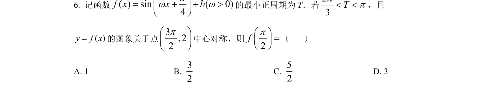
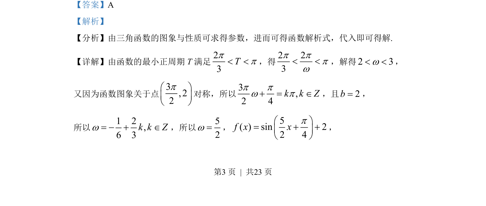
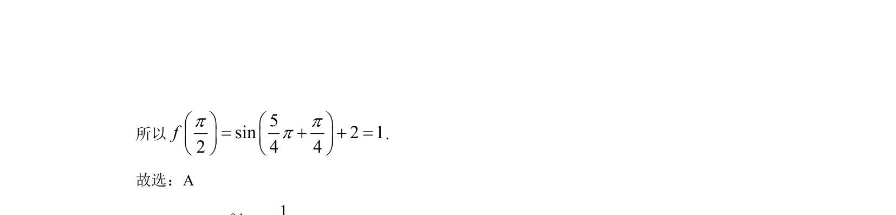

## 题面

## 摘要

本题考查三角函数的周期和对称性求参数，并计算函数值。

## 关联考点

- [[611-三角函数的周期性|三角函数的周期性]]
- [[三角函数的对称性]]
- [[由条件求解析式]]
- [[684-函数求值|函数求值]]

## 答案与解析

> 📄 原 PDF 第 3 页：`素材/真题/湖南/2008-2024·（湖南）数学高考真题/2022年高考数学试卷（新高考Ⅰ卷）（解析卷）.pdf`
