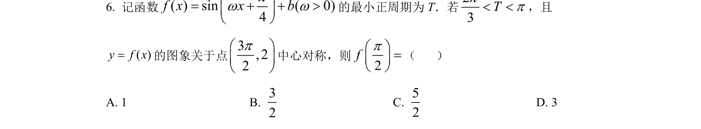
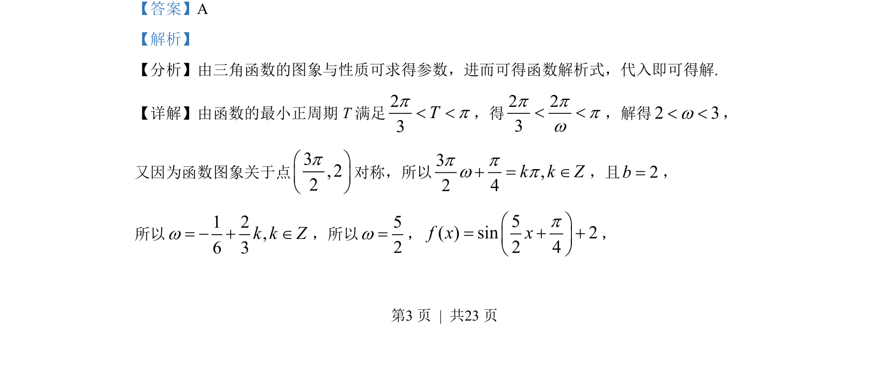
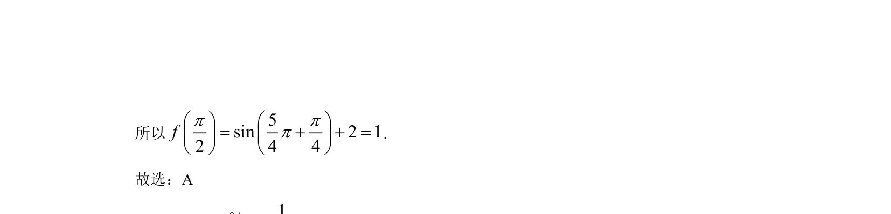

## 题面

## 摘要

本题考查三角函数的周期和对称性求参数，并计算函数值。

## 关联考点

- [[611-三角函数的周期性|三角函数的周期性]]
- [[三角函数的对称性]]
- [[由条件求解析式]]
- [[684-函数求值|函数求值]]

## 答案与解析

> 📄 原 PDF 第 3 页：`素材/真题/湖南/2008-2024·（湖南）数学高考真题/2022年高考数学试卷（新高考Ⅰ卷）（解析卷）.pdf`

<!-- 题干文本-start -->
## 题干文本
6. 记函数( ) sin ( 0)4f x x bpw wæ ö= + + >ç ÷è ø
的最小正周期为 T．若23Tpp< <，且
( )y f x=的图象关于点
3, 22pæ öç ÷è ø
中心对称，则2fpæ ö=ç ÷è ø
（    ）
A. 1 B. 32
C. 52
D. 3
<!-- 题干文本-end -->

<!-- 解析文本-start -->
## 解析文本
【答案】A
【解析】
【分析】由三角函数的图象与性质可求得参数，进而可得函数解析式，代入即可得解.
【详解】由函数的最小正周期 T 满足23Tpp< <，得2 23p ppw< <，解得2 3w< <，
又因为函数图象关于点
3, 22pæ öç ÷è ø
对称，所以3,2 4k k Zp pw p+ = Î，且2b=，
所以1 2,6 3k k Zw= - + Î，所以52w=，
5( ) sin 22 4f x xpæ ö= + +ç ÷è ø
，
<!-- 解析文本-end -->
