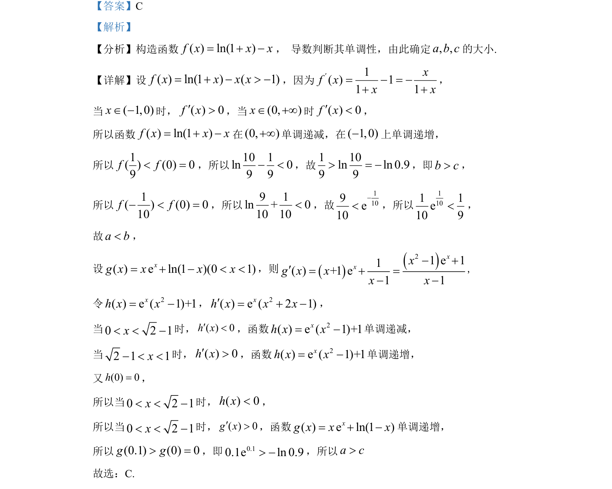

## 题面

## 摘要

构造函数比较大小，利用导数研究函数单调性解决问题。

## 关联考点

- [[425-反函数导数|导数]]
- [[719-单调性|单调性]]
- [[889-数值比较|比较大小]]
- [[923-构造函数|构造函数]]

## 答案与解析

> 📄 原 PDF 第 4 页：`素材/真题/湖南/2008-2024·（湖南）数学高考真题/2022年高考数学试卷（新高考Ⅰ卷）（解析卷）.pdf`
