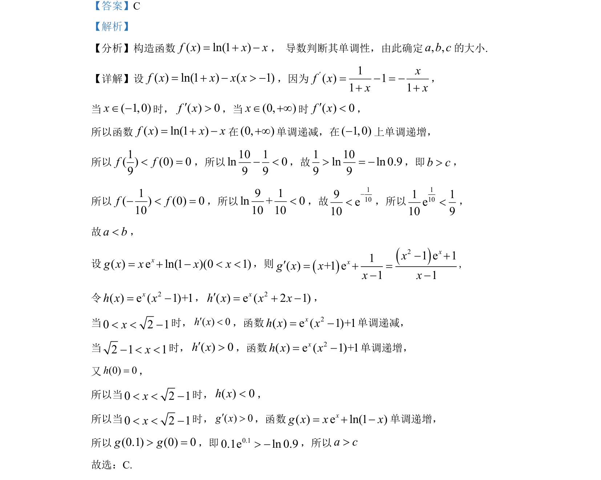

## 题面

## 摘要

构造函数比较大小，利用导数研究函数单调性解决问题。

## 关联考点

- [[425-反函数导数|导数]]
- [[719-单调性|单调性]]
- [[889-数值比较|比较大小]]
- [[923-构造函数|构造函数]]

## 答案与解析

> 📄 原 PDF 第 4 页：`素材/真题/湖南/2008-2024·（湖南）数学高考真题/2022年高考数学试卷（新高考Ⅰ卷）（解析卷）.pdf`

<!-- 题干文本-start -->
## 题干文本
7. 设 0.110.1e , ln 0.99a b c= = = -，，则（    ）
A. a b c< <B. c b a< <C. c a b< <D. 
a c b< <
<!-- 题干文本-end -->

<!-- 解析文本-start -->
## 解析文本
【答案】C
【解析】
【分析】构造函数( ) ln(1 )f x x x= + -， 导数判断其单调性，由此确定, ,a b c大小.
【详解】设( ) ln(1 ) ( 1)f x x x x= + - > -，因为1( ) 11 1xf xx x¢= - = -+ +
，
当( 1,0)xÎ -时，( ) 0f x¢>，当,( )0xÎ +¥时( ) 0f x¢<，
所以函数( ) ln(1 )f x x x= + -在(0, )+¥单调递减，在( 1,0)-上单调递增，
所以1( ) (0) 09f f< =，所以10 1ln 09 9- <，故1 10ln ln 0.99 9> = -，即b c>，
所以1( ) (0) 010f f- < =，所以9 1ln + 010 10<，故
1109e10-<，所以
1101 1e10 9<，
故a b<，
设( ) e ln(1 )(0 1)xg x x x x= + - < <，则21 e 11( ) +1 e1 1xxxg x xx x- +¢= + =- -
,
令 2( ) e ( 1)+1xh x x= -， 2( ) e ( 2 1)xh x x x¢= + -，
当0 2 1x< < -时，( ) 0h x¢<，函数 2( ) e ( 1)+1xh x x= -单调递减，
当2 1 1x- < <时，( ) 0h x¢>，函数 2( ) e ( 1)+1xh x x= -单调递增，
又(0) 0h=，
所以当0 2 1x< < -时，( ) 0h x<，
所以当0 2 1x< < -时，( ) 0g x¢>，函数( ) e ln(1 )xg x x x= + -单调递增，
所以(0.1) (0) 0g g> =，即0.10.1e ln 0.9> -，所以a c>
故选：C.
<!-- 解析文本-end -->
