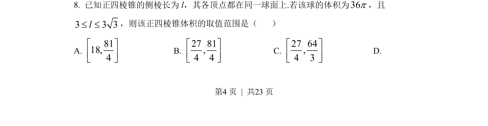
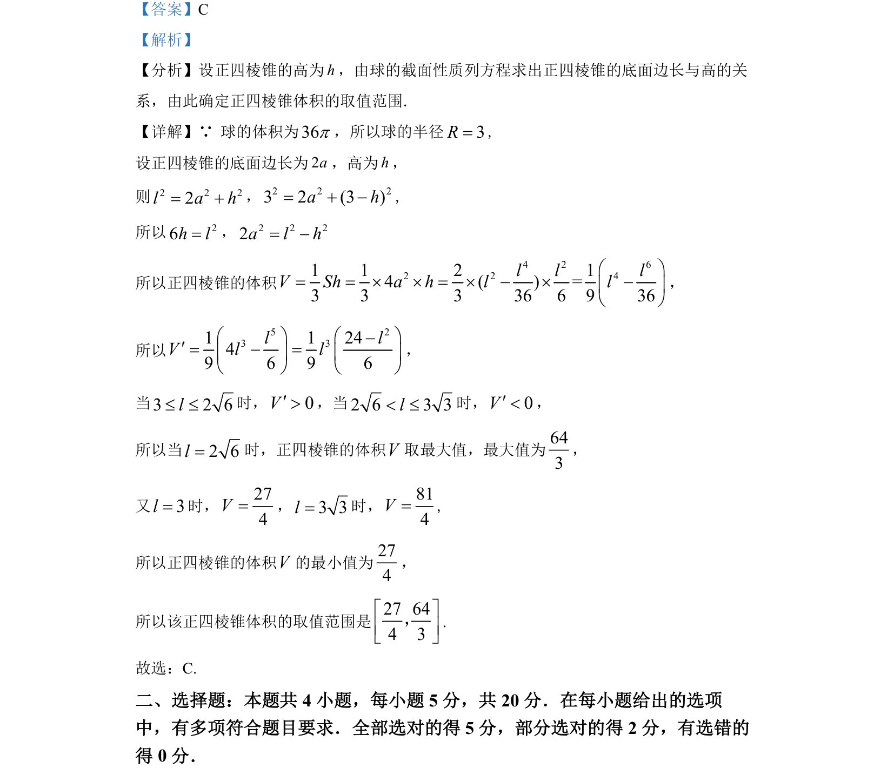

## 题面

## 摘要

该题考查球内接正四棱锥的体积取值范围，通过球截面性质建立侧棱与高关系，构造函数并利用导数求最值。

## 关联考点

- [[球的内接几何体]]
- [[正四棱锥体积]]
- [[1287-导数与函数最值|导数与函数最值]]

## 答案与解析

> 📄 原 PDF 第 4 页：`素材/真题/湖南/2008-2024·（湖南）数学高考真题/2022年高考数学试卷（新高考Ⅰ卷）（解析卷）.pdf`
