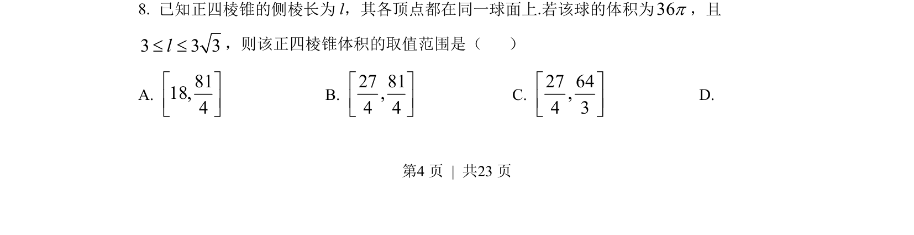
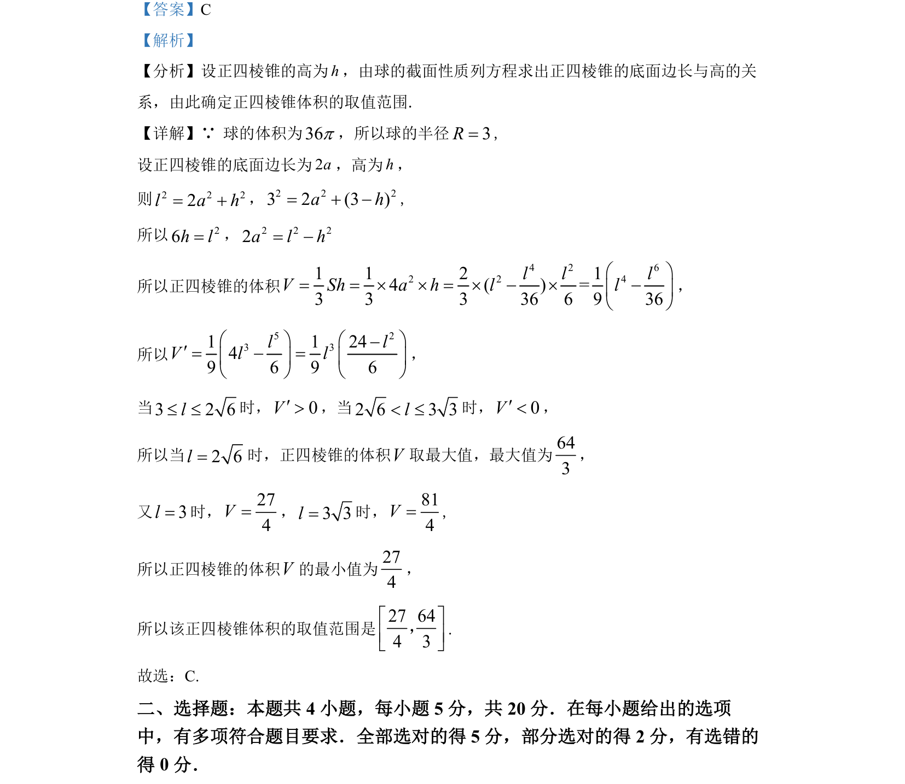

## 题面

## 摘要

该题考查球内接正四棱锥的体积取值范围，通过球截面性质建立侧棱与高关系，构造函数并利用导数求最值。

## 关联考点

- [[球的内接几何体]]
- [[正四棱锥体积]]
- [[1287-导数与函数最值|导数与函数最值]]

## 答案与解析

> 📄 原 PDF 第 4 页：`素材/真题/湖南/2008-2024·（湖南）数学高考真题/2022年高考数学试卷（新高考Ⅰ卷）（解析卷）.pdf`

<!-- 题干文本-start -->
## 题干文本
8. 已知正四棱锥的侧棱长为 l，其各顶点都在同一球面上.若该球的体积为36p，且
3 3 3l£ £，则该正四棱锥体积的取值范围是（    ）
A. 8118,4é ùê úë û
B. 27 81,4 4é ùê úë û
C. 27 64,4 3é ùê úë û
D. 
的
<!-- 题干文本-end -->

<!-- 解析文本-start -->
## 解析文本

<!-- 解析文本-end -->
