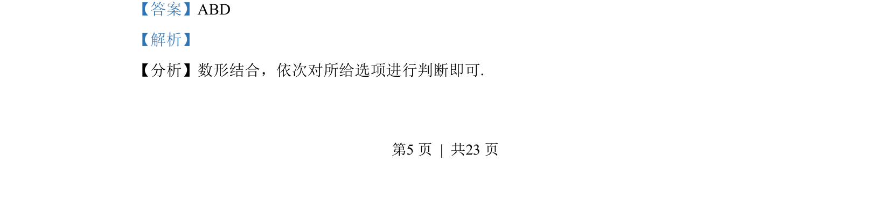
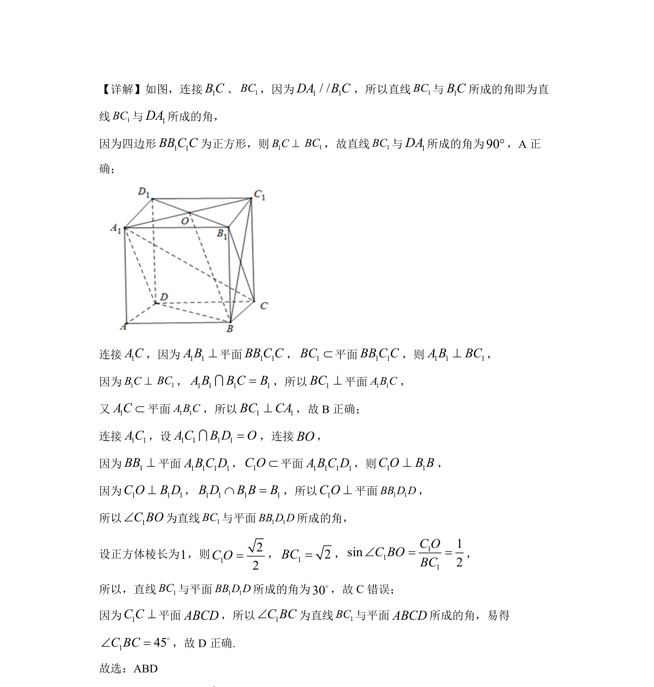

## 题面

## 摘要

考查正方体中异面直线所成角、线面垂直及线面角的判断

## 关联考点

- [[353-空间角|异面直线所成角]]
- [[1085-线面垂直的判定|线面垂直的判定]]
- [[353-空间角|线面角]]
- [[1195-正方体性质|正方体性质]]

## 答案与解析

> 📄 原 PDF 第 5 页：`素材/真题/湖南/2008-2024·（湖南）数学高考真题/2022年高考数学试卷（新高考Ⅰ卷）（解析卷）.pdf`
