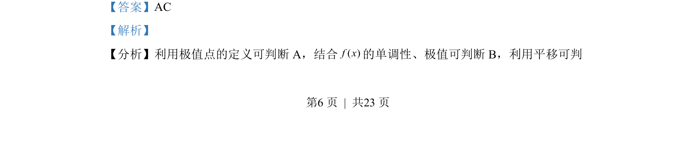
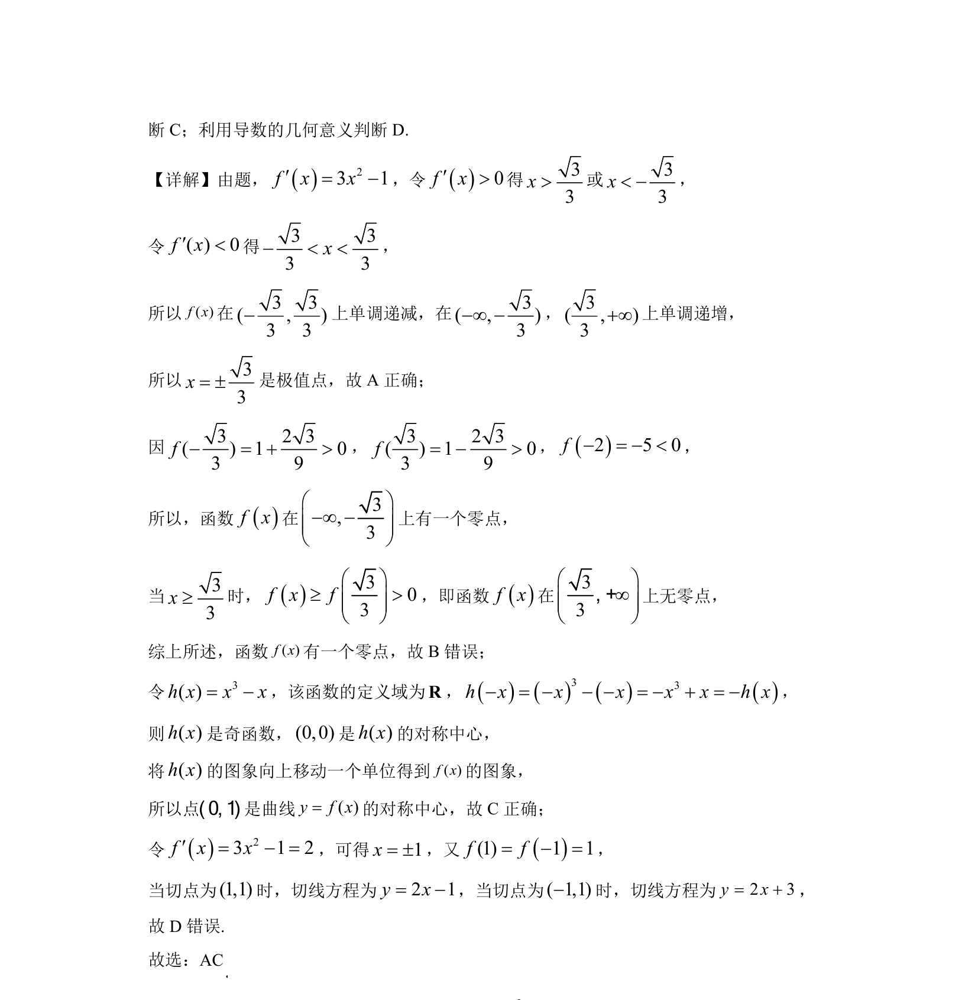

## 题面

## 摘要

考查利用导数研究三次函数的单调性、极值点与零点个数，并涉及导数的几何意义。

## 关联考点

- [[1173-极值点|极值点]]
- [[705-利用导数研究函数的单调性|利用导数研究函数的单调性]]
- [[288-函数零点|函数的零点]]
- [[440-导数的几何意义|导数的几何意义]]

## 答案与解析

> 📄 原 PDF 第 6 页：`素材/真题/湖南/2008-2024·（湖南）数学高考真题/2022年高考数学试卷（新高考Ⅰ卷）（解析卷）.pdf`
