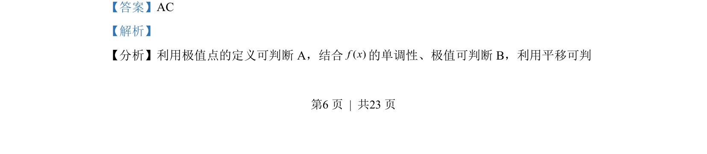
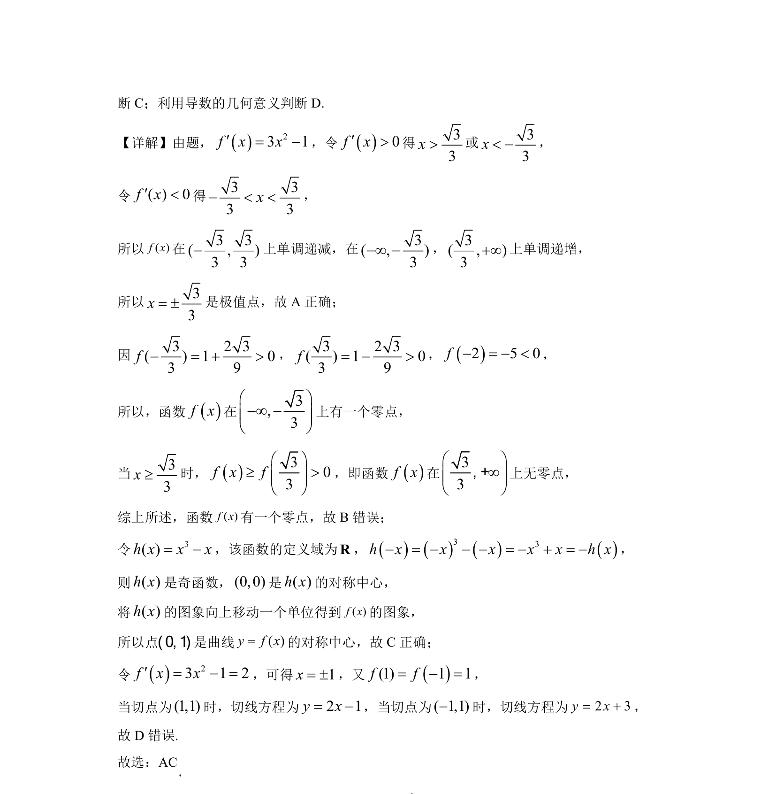

## 题面

## 摘要

考查利用导数研究三次函数的单调性、极值点与零点个数，并涉及导数的几何意义。

## 关联考点

- [[1173-极值点|极值点]]
- [[705-利用导数研究函数的单调性|利用导数研究函数的单调性]]
- [[288-函数零点|函数的零点]]
- [[440-导数的几何意义|导数的几何意义]]

## 答案与解析

> 📄 原 PDF 第 6 页：`素材/真题/湖南/2008-2024·（湖南）数学高考真题/2022年高考数学试卷（新高考Ⅰ卷）（解析卷）.pdf`

<!-- 题干文本-start -->
## 题干文本
10. 已知函数 3( ) 1f x x x= - +，则（    ）
A. ( )f x有两个极值点 B. ( )f x有三个零点
C. 点( 0, 1 )是曲线( )y f x=的对称中心 D. 直线2y x=是曲线( )y f x=的切
线
<!-- 题干文本-end -->

<!-- 解析文本-start -->
## 解析文本
【答案】AC
【解析】
【分析】利用极值点的定义可判断 A，结合( )f x的单调性、极值可判断 B，利用平移可判
<!-- 解析文本-end -->
