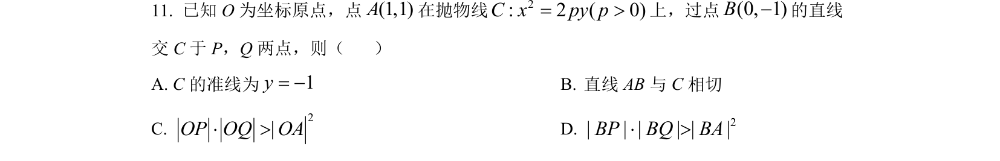
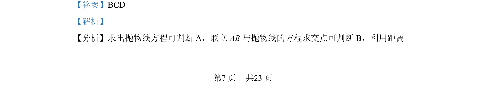
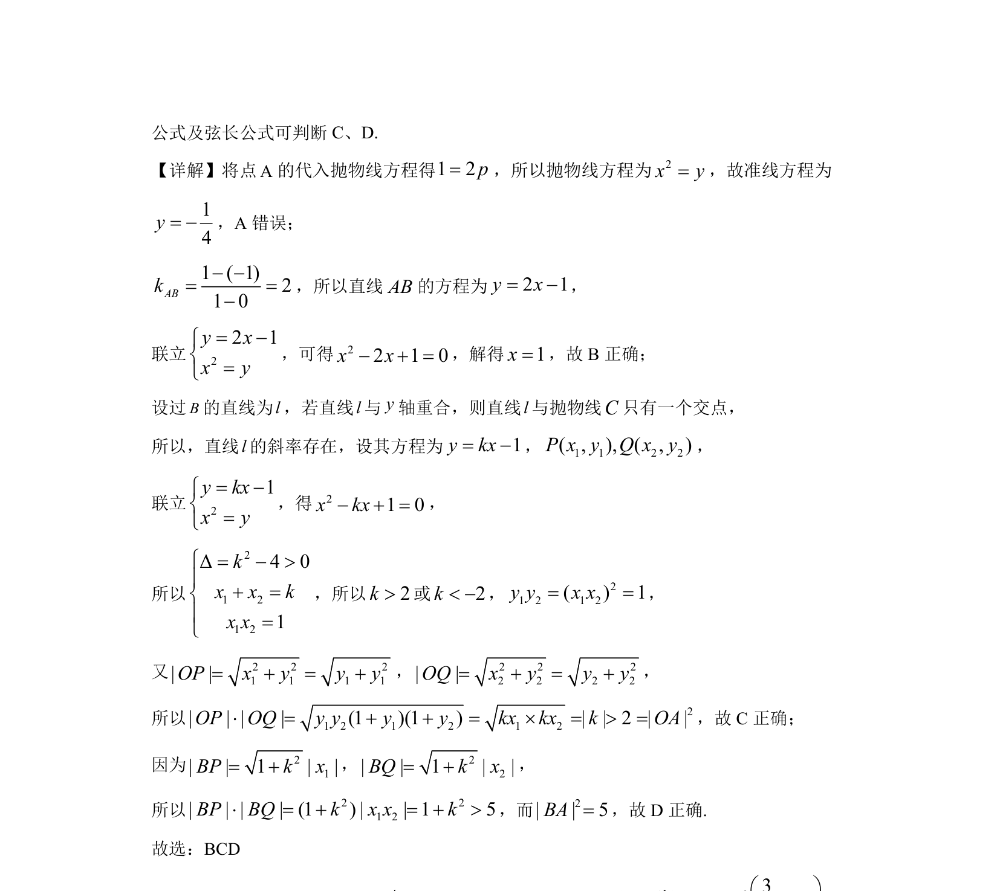

## 题面

## 摘要

考查抛物线标准方程及几何性质，直线与抛物线的位置关系及弦长问题。

## 关联考点

- [[抛物线标准方程与几何性质]]
- [[1017-直线与抛物线的位置关系|直线与抛物线的位置关系]]
- [[867-弦长公式|弦长公式]]

## 答案与解析

> 📄 原 PDF 第 7 页：`素材/真题/湖南/2008-2024·（湖南）数学高考真题/2022年高考数学试卷（新高考Ⅰ卷）（解析卷）.pdf`
