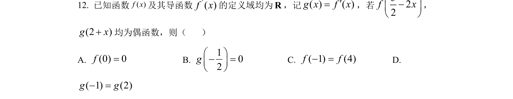
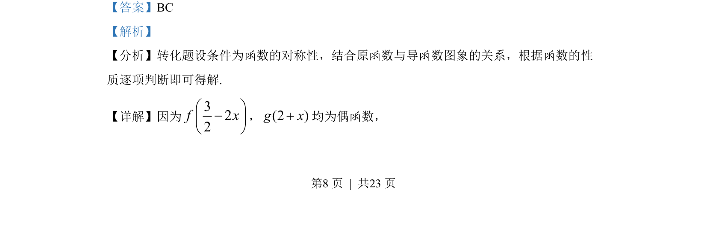
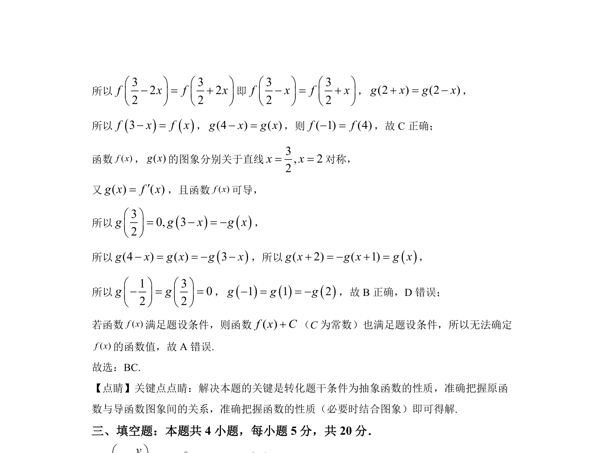

## 题面

## 摘要

本题考查抽象函数的对称性与周期性，结合导数关系判断函数值及相关性质。

## 关联考点

- [[882-抽象函数|抽象函数]]
- [[834-对称性|对称性]]
- [[761-周期性|周期性]]
- [[425-反函数导数|导数]]

## 答案与解析

> 📄 原 PDF 第 8 页：`素材/真题/湖南/2008-2024·（湖南）数学高考真题/2022年高考数学试卷（新高考Ⅰ卷）（解析卷）.pdf`
