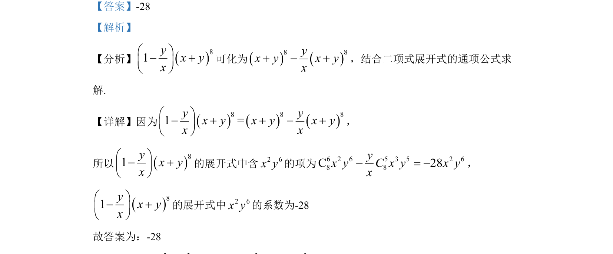

## 题面

## 摘要

求二项式乘积展开式中含x²y⁶项的系数.

## 关联考点

- [[472-二项式定理|二项式定理]]
- [[1160-展开式通项|展开式通项]]
- [[组合数计算]]

## 答案与解析

> 📄 原 PDF 第 9 页：`素材/真题/湖南/2008-2024·（湖南）数学高考真题/2022年高考数学试卷（新高考Ⅰ卷）（解析卷）.pdf`

<!-- 题干文本-start -->
## 题干文本
13. 81 ( )yx yxæ ö- +ç ÷è ø
的展开式中2 6x y的系数为________________（用数字作答） ．
<!-- 题干文本-end -->

<!-- 解析文本-start -->
## 解析文本
【答案】-28
【解析】
【分析】81yx yxæ ö- +ç ÷è ø
可化为8 8yx y x yx+ - +，结合二项式展开式的通项公式求
解.
【详解】因为8 8 81 =y yx y x y x yx xæ ö- + + - +ç ÷è ø
，
所以81yx yxæ ö- +ç ÷è ø
的展开式中含2 6x y的项为6 2 6 5 3 5 2 68 8C 28yx y C x y x yx- = -，
81yx yxæ ö- +ç ÷è ø
的展开式中2 6x y的系数为-28
故答案为：-28
<!-- 解析文本-end -->
