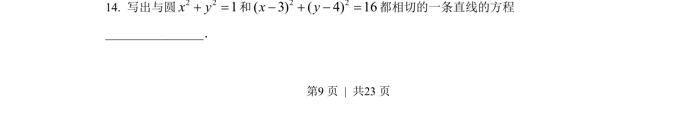
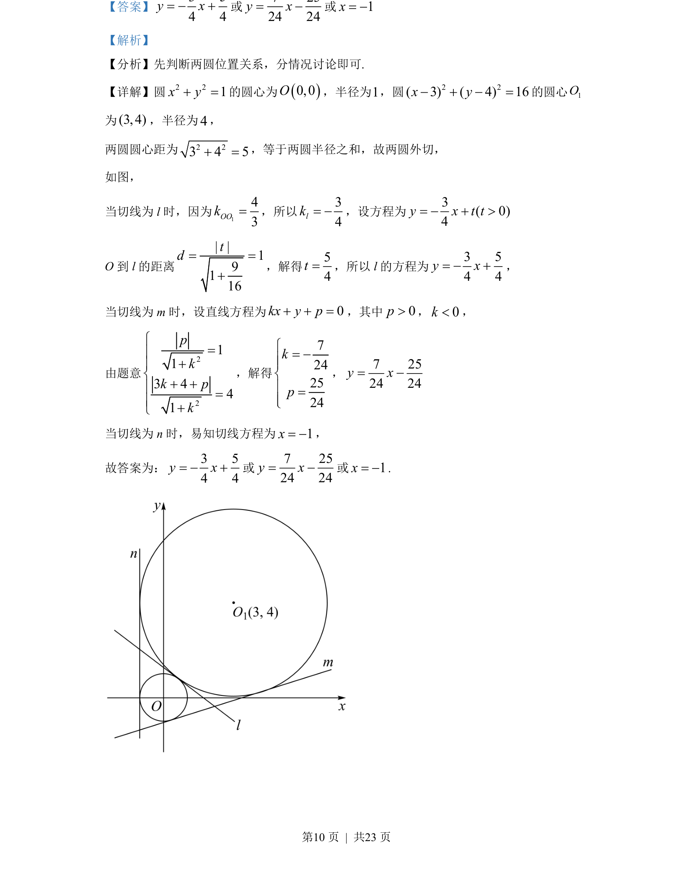

## 题面

## 摘要

判断两圆外切后，利用圆心距、半径及点到直线距离公式分类求解公切线方程

## 关联考点

- [[373-圆的标准方程|圆的标准方程]]
- [[222-圆和圆的位置关系|两圆位置关系]]
- [[570-点到直线的距离公式|点到直线的距离公式]]
- [[切线方程求解]]

## 答案与解析

> 📄 原 PDF 第 9 页：`素材/真题/湖南/2008-2024·（湖南）数学高考真题/2022年高考数学试卷（新高考Ⅰ卷）（解析卷）.pdf`
