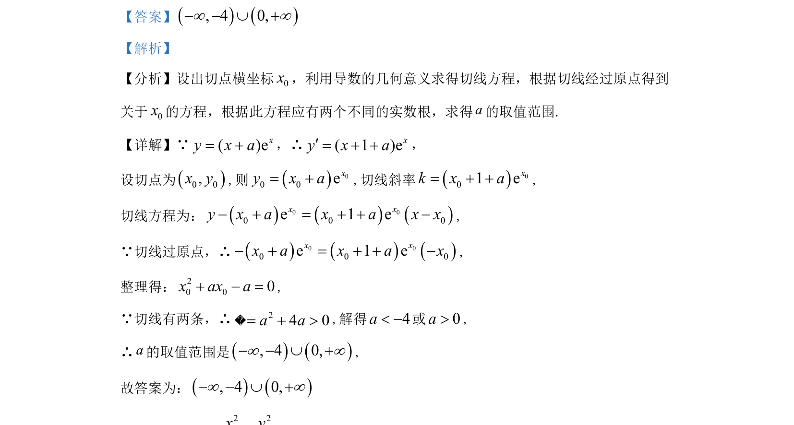

## 题面

## 摘要

考查利用导数几何意义求解过原点的切线方程，通过切线数量求参数范围。

## 关联考点

- [[839-导数几何意义|导数几何意义]]
- [[422-切线方程|切线方程]]
- [[二次方程判别式]]
- [[726-参数范围|参数范围]]

## 答案与解析

> 📄 原 PDF 第 11 页：`素材/真题/湖南/2008-2024·（湖南）数学高考真题/2022年高考数学试卷（新高考Ⅰ卷）（解析卷）.pdf`
