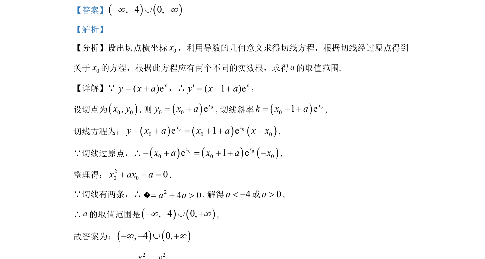

## 题面

## 摘要

考查利用导数几何意义求解过原点的切线方程，通过切线数量求参数范围。

## 关联考点

- [[440-导数的几何意义|导数几何意义]]
- [[422-切线方程|切线方程]]
- [[二次方程判别式]]
- [[726-参数范围|参数范围]]

## 答案与解析

> 📄 原 PDF 第 11 页：`素材/真题/湖南/2008-2024·（湖南）数学高考真题/2022年高考数学试卷（新高考Ⅰ卷）（解析卷）.pdf`

<!-- 题干文本-start -->
## 题干文本
15. 若曲线( )exy x a= +有两条过坐标原点的切线，则 a 的取值范围是
________________．
<!-- 题干文本-end -->

<!-- 解析文本-start -->
## 解析文本
【答案】, 4 0,¥ ¥- - È +
【解析】
【分析】设出切点横坐标0x，利用导数的几何意义求得切线方程，根据切线经过原点得到
关于0x的方程，根据此方程应有两个不同的实数根，求得a的取值范围.
【详解】∵( )exy x a= +，∴( 1 )exy x a¢= + +，
设切点为0 0,x y,则00 0exy x a= +,切线斜率001 exk x a= + +,
切线方程为：0 00 0 0e 1 ex xy x a x a x x- + = + + -,
∵切线过原点，∴0 00 0 0e 1 ex xx a x a x- + = + + -,
整理得：20 00x ax a+ - =,
∵切线有两条，∴24 0a a= + >n,解得4a< -或0a>,
∴a的取值范围是, 4 0,¥ ¥- - È +,
故答案为：, 4 0,¥ ¥- - È +
<!-- 解析文本-end -->
