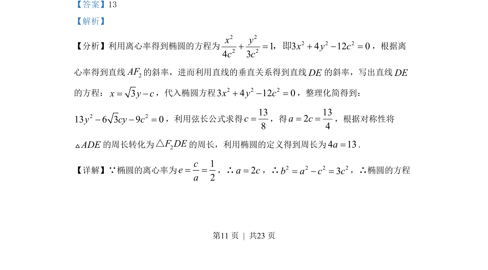
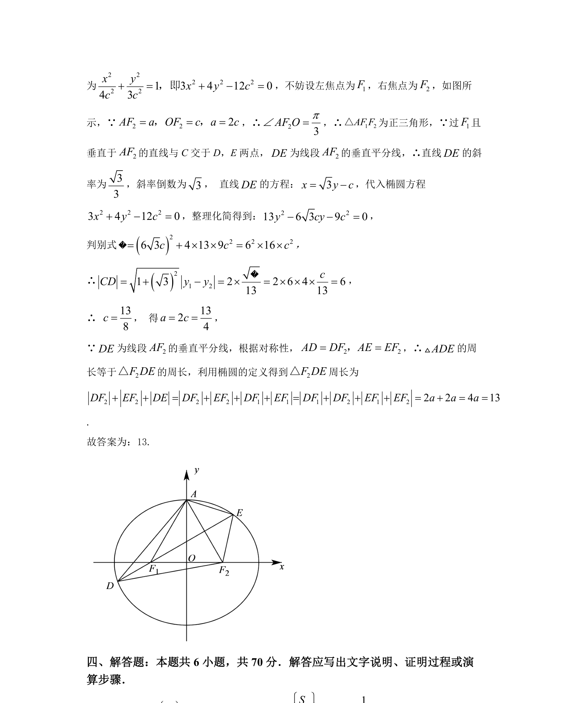

## 题面

## 摘要

结合椭圆离心率求直线方程，联立方程利用弦长公式求参数，再用椭圆定义求三角形周长。

## 关联考点

- [[061-方程|椭圆的标准方程]]
- [[391-椭圆离心率|离心率]]
- [[直线斜率与垂直关系]]
- [[867-弦长公式|弦长公式]]
- [[椭圆的定义]]

## 答案与解析

> 📄 原 PDF 第 11 页：`素材/真题/湖南/2008-2024·（湖南）数学高考真题/2022年高考数学试卷（新高考Ⅰ卷）（解析卷）.pdf`
