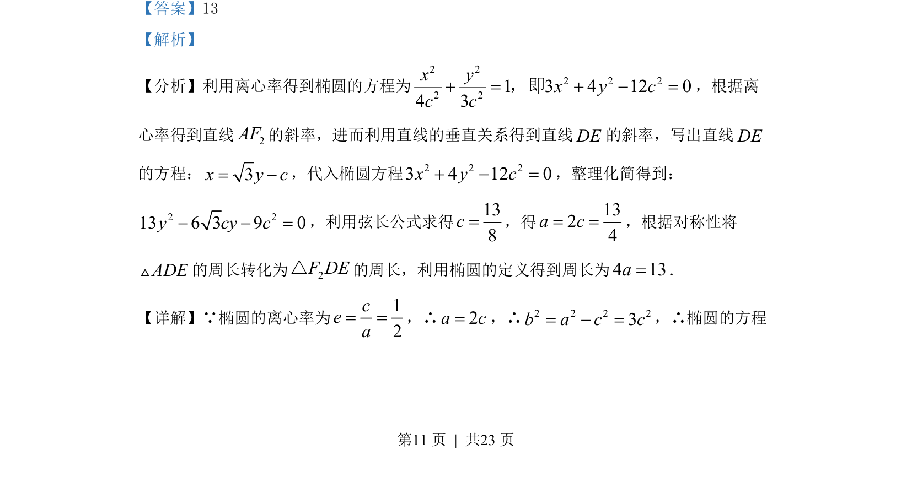
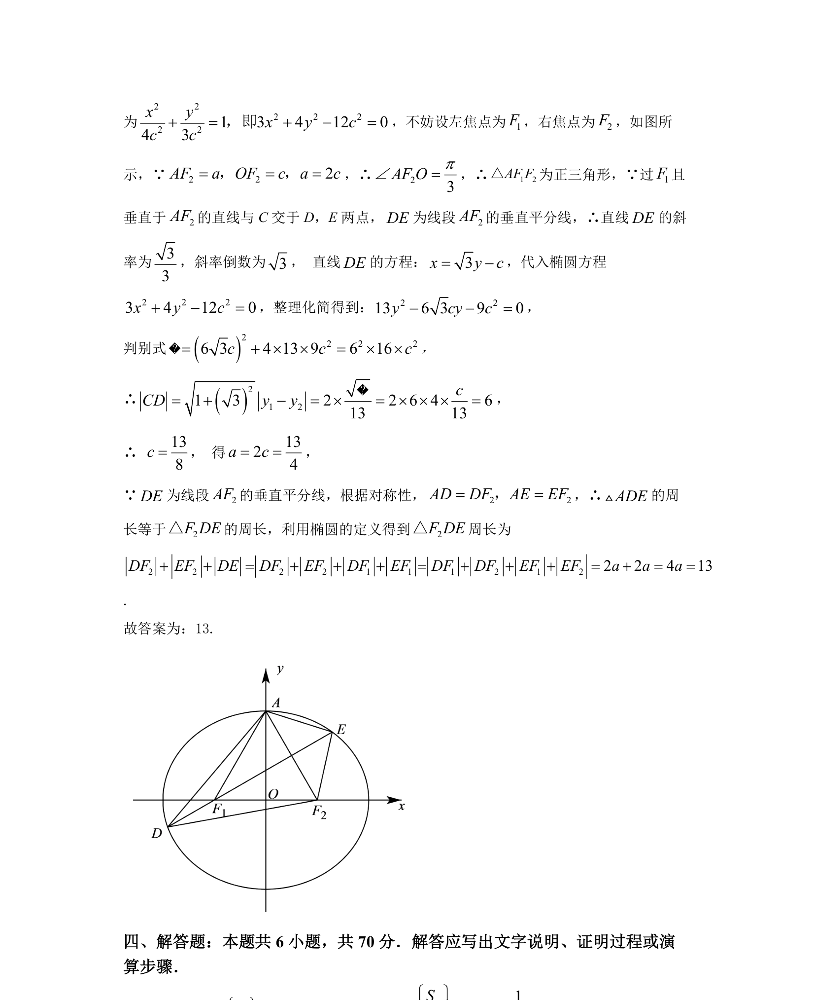

## 题面

## 摘要

结合椭圆离心率求直线方程，联立方程利用弦长公式求参数，再用椭圆定义求三角形周长。

## 关联考点

- [[061-方程|椭圆的标准方程]]
- [[391-椭圆离心率|离心率]]
- [[直线斜率与垂直关系]]
- [[867-弦长公式|弦长公式]]
- [[1413-椭圆的定义|椭圆的定义]]

## 答案与解析

> 📄 原 PDF 第 11 页：`素材/真题/湖南/2008-2024·（湖南）数学高考真题/2022年高考数学试卷（新高考Ⅰ卷）（解析卷）.pdf`

<!-- 题干文本-start -->
## 题干文本
16. 已知椭圆
2 22 2: 1( 0)x yC a ba b+ = > >，C的上顶点为 A，两个焦点为1F，2F，离心率
为12．过1F且垂直于2AF的直线与 C交于 D，E两点，| | 6DE=，则ADEV的周长是
________________．
<!-- 题干文本-end -->

<!-- 解析文本-start -->
## 解析文本
【答案】13
【解析】
【分析】利用离心率得到椭圆的方程为
2 22 2 22 21 3 4 12 04 3x yx y cc c+ = + - =，即，根据离
心率得到直线2AF的斜率，进而利用直线的垂直关系得到直线DE的斜率，写出直线DE
的方程：3x y c= -，代入椭圆方程2 2 23 4 12 0x y c+ - =，整理化简得到：
2 213 6 3 9 0y cy c- - =，利用弦长公式求得138c=，得1324a c= =，根据对称性将
ADEV的周长转化为2F DE△的周长，利用椭圆的定义得到周长为4 13a=.
【详解】∵椭圆的离心率为12cea= =，∴2a c=，∴2 2 2 23b a c c= - =，∴椭圆的方程
<!-- 解析文本-end -->
