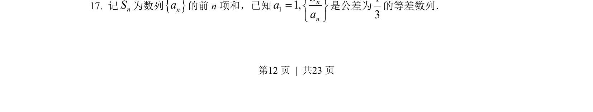
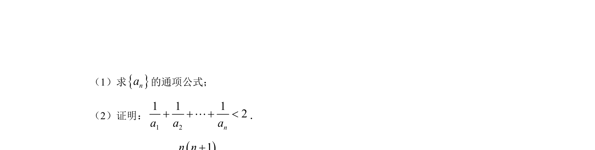
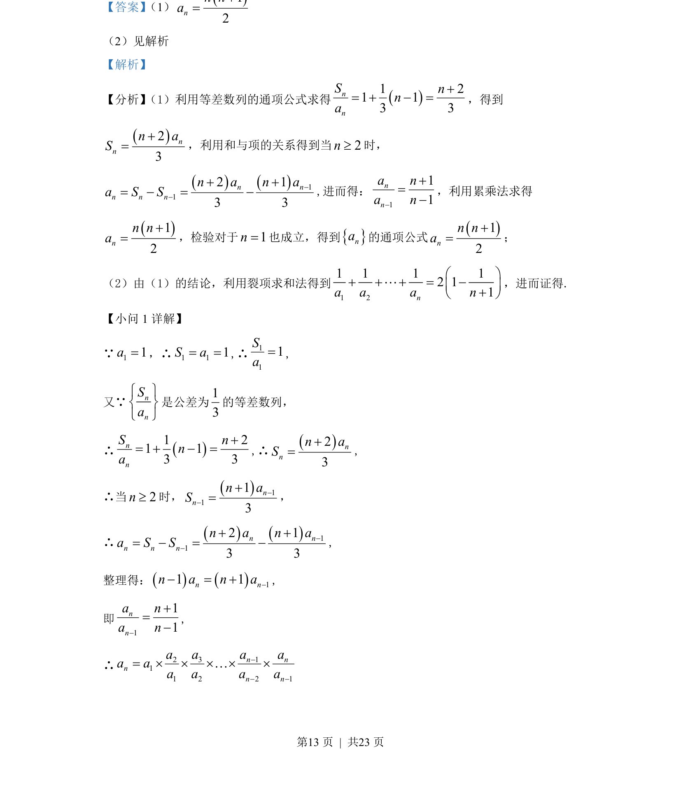
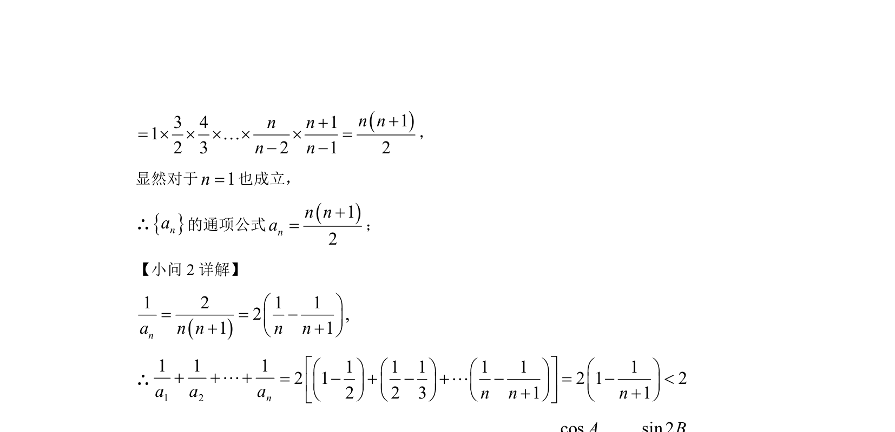

## 题面

## 摘要

已知等差数列，利用和与项关系及累乘法求通项，并用裂项相消法证明数列不等式。

## 关联考点

- [[356-等差数列概念|等差数列]]
- [[和与项的关系]]
- [[累乘法求通项]]
- [[裂项相消法求和]]

## 答案与解析

> 📄 原 PDF 第 12 页：`素材/真题/湖南/2008-2024·（湖南）数学高考真题/2022年高考数学试卷（新高考Ⅰ卷）（解析卷）.pdf`
