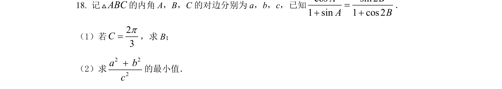
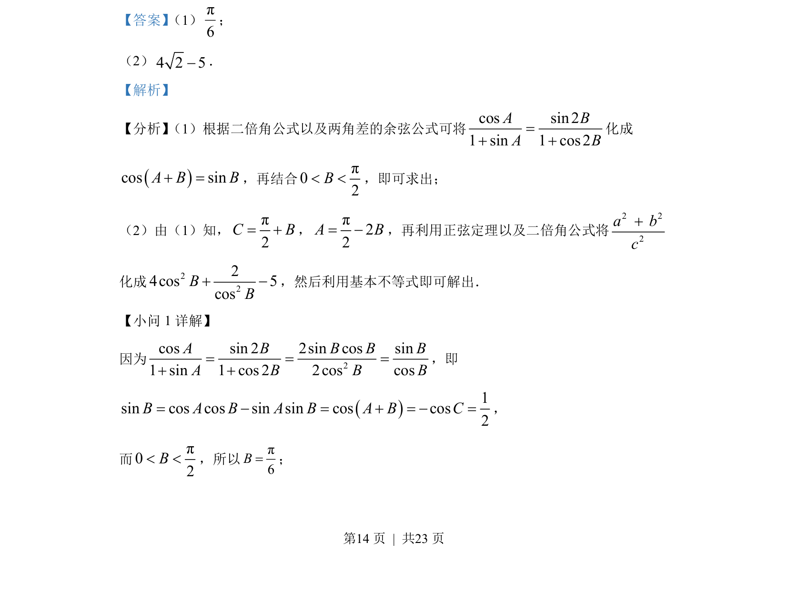
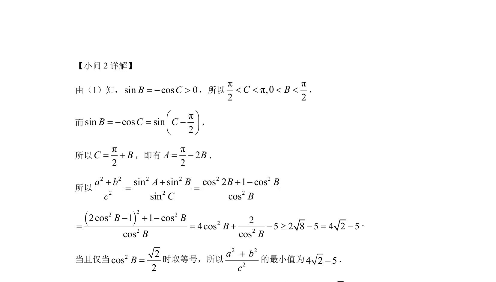

## 题面

## 摘要

考查三角恒等变换、正弦定理与基本不等式求最值。

## 关联考点

- [[637-二倍角公式|二倍角公式]]
- [[两角差的余弦公式]]
- [[126-定理|正弦定理]]
- [[295-基本不等式|基本不等式]]

## 答案与解析

> 📄 原 PDF 第 14 页：`素材/真题/湖南/2008-2024·（湖南）数学高考真题/2022年高考数学试卷（新高考Ⅰ卷）（解析卷）.pdf`
