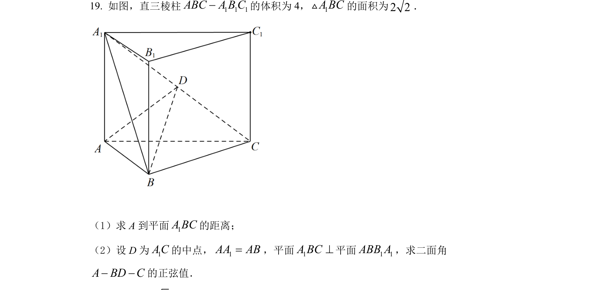
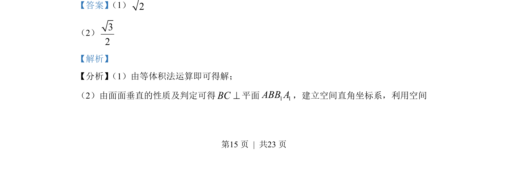
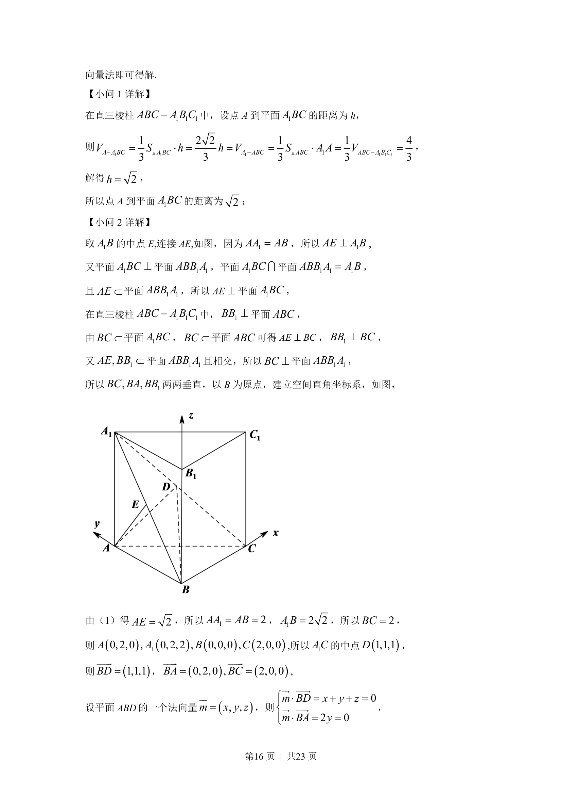
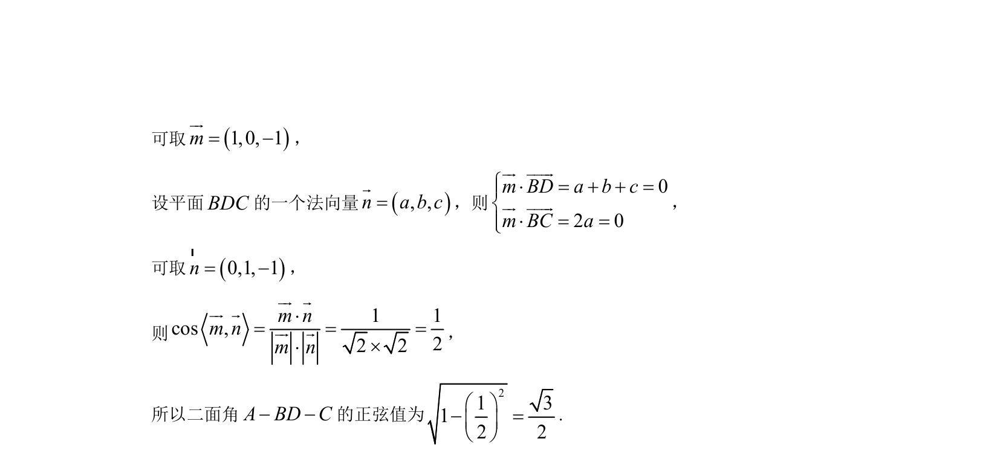

## 题面

## 摘要

该题考查直三棱柱中点面距与空间向量法的应用，涉及等体积法与坐标系的建立。

## 关联考点

- [[1057-等体积法|等体积法]]
- [[593-面面垂直性质|面面垂直性质]]
- [[579-空间向量法|空间向量法]]

## 答案与解析

> 📄 原 PDF 第 15 页：`素材/真题/湖南/2008-2024·（湖南）数学高考真题/2022年高考数学试卷（新高考Ⅰ卷）（解析卷）.pdf`
