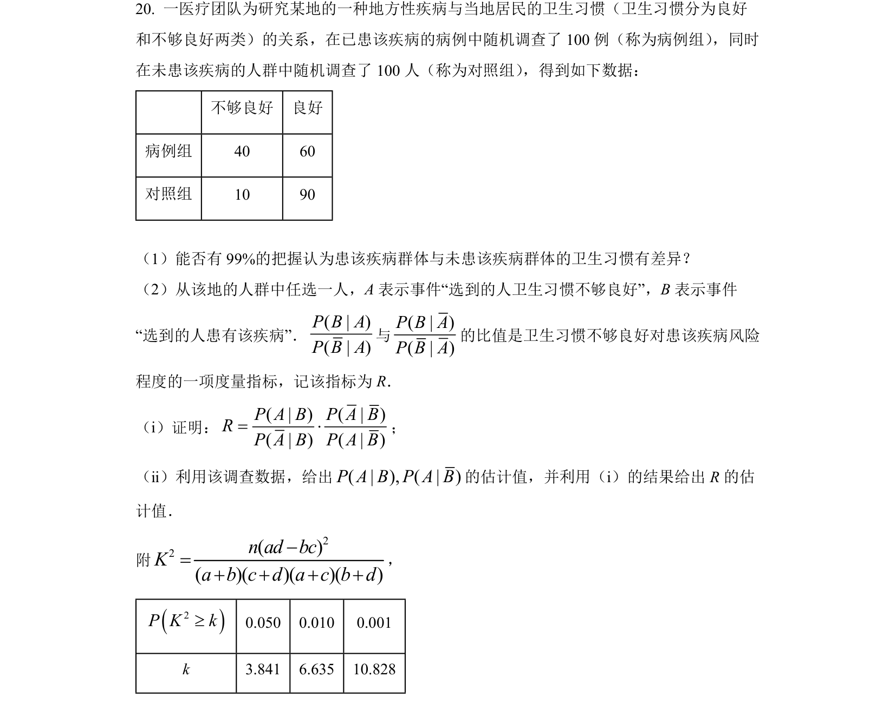
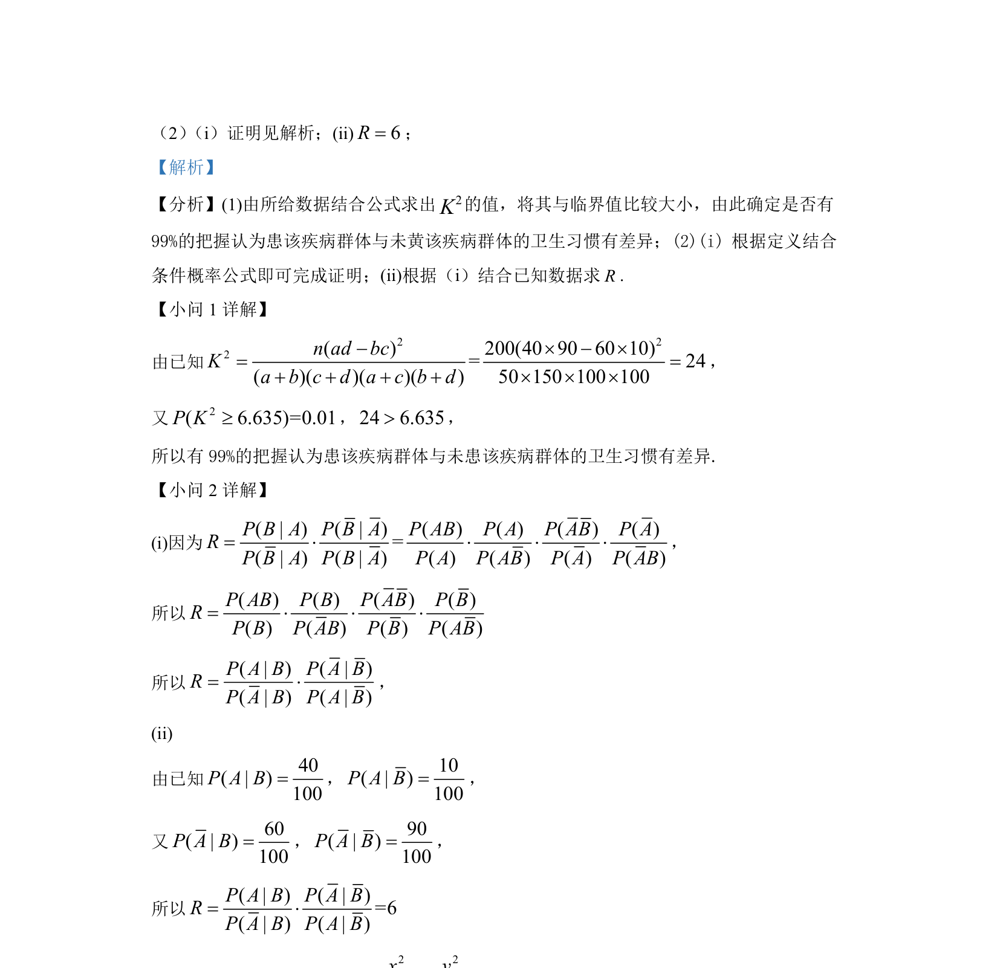

## 题面

## 摘要

考查独立性检验与条件概率的证明及计算，涉及K²公式与概率恒等变形。

## 关联考点

- [[497-独立性检验|独立性检验]]
- [[340-条件概率初步|条件概率]]
- [[概率恒等变形]]

## 答案与解析

> 📄 原 PDF 第 17 页：`素材/真题/湖南/2008-2024·（湖南）数学高考真题/2022年高考数学试卷（新高考Ⅰ卷）（解析卷）.pdf`
