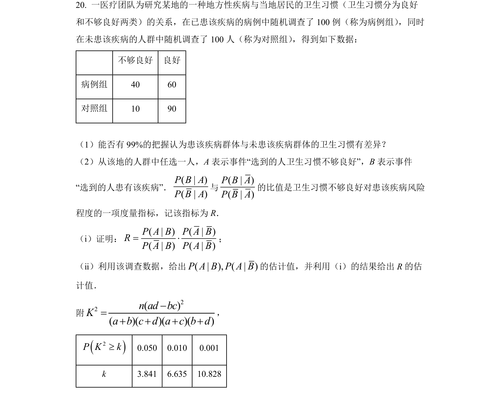
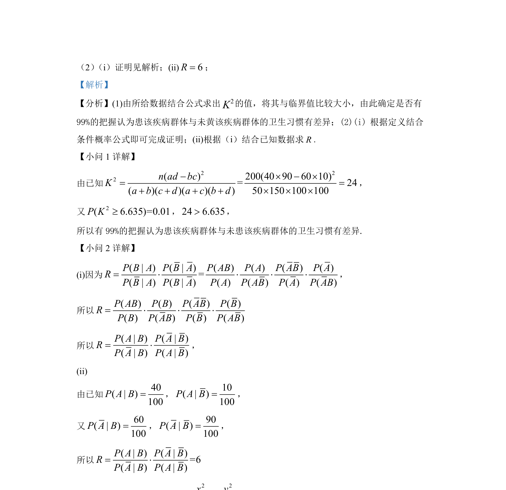

## 题面

## 摘要

考查独立性检验与条件概率的证明及计算，涉及K²公式与概率恒等变形。

## 关联考点

- [[497-独立性检验|独立性检验]]
- [[340-条件概率初步|条件概率]]
- [[概率恒等变形]]

## 答案与解析

> 📄 原 PDF 第 17 页：`素材/真题/湖南/2008-2024·（湖南）数学高考真题/2022年高考数学试卷（新高考Ⅰ卷）（解析卷）.pdf`

<!-- 题干文本-start -->
## 题干文本
20. 一医疗团队为研究某地的一种地方性疾病与当地居民的卫生习惯（卫生习惯分为良好
和不够良好两类）的关系，在已患该疾病的病例中随机调查了 100 例（称为病例组） ，同时
在未患该疾病的人群中随机调查了 100 人（称为对照组） ，得到如下数据：
不够良好 良好
病例组 40 60
对照组 10 90
（1）能否有 99%的把握认为患该疾病群体与未患该疾病群体的卫生习惯有差异？
（2）从该地的人群中任选一人，A表示事件“选到的人卫生习惯不够良好”，B表示事件
“选到的人患有该疾病”．
( | )( | )P B AP B A与( | )( | )P B AP B A
的比值是卫生习惯不够良好对患该疾病风险
程度的一项度量指标，记该指标为 R．
（ⅰ）证明：( | ) ( | )( | ) ( | )P A B P A BRP A B P A B= ×；
（ⅱ）利用该调查数据，给出( | ), ( | )P A B P A B的估计值，并利用（ⅰ）的结果给出 R的估
计值．
附
22( )( )( )( )( )n ad bcKa b c d a c b d-=+ + + +
，
()2P K k³0.050 0.010 0.001
k 3.841 6.635 10.828
<!-- 题干文本-end -->

<!-- 解析文本-start -->
## 解析文本
【答案】 （1）答案见解析
<!-- 解析文本-end -->
