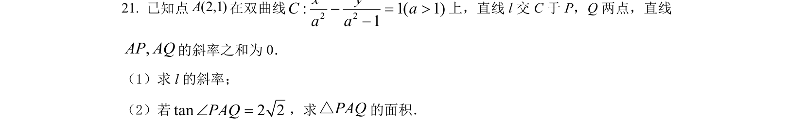
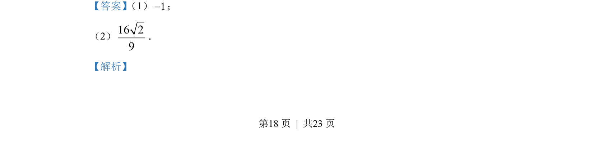
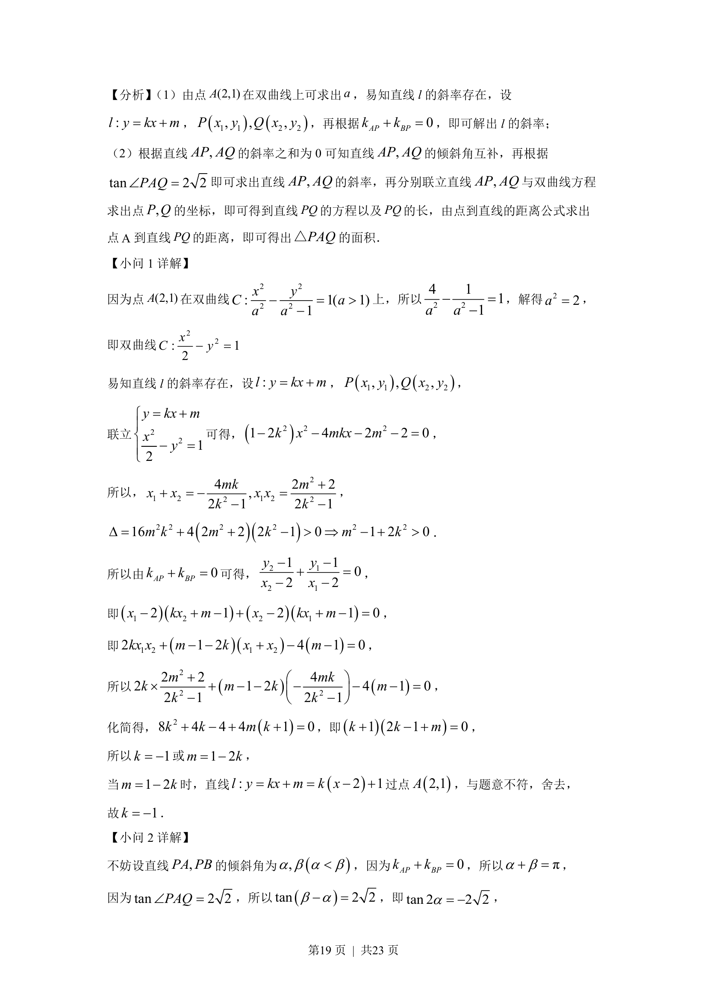
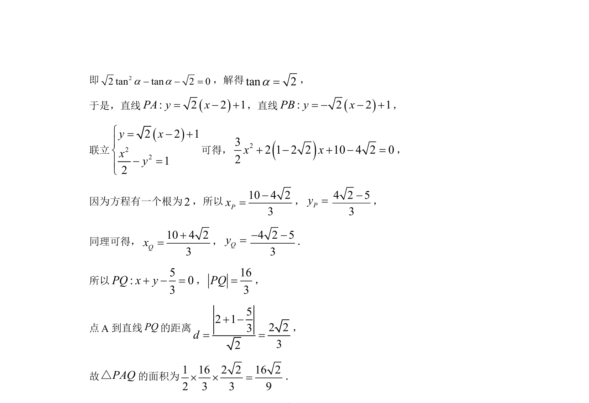

## 题面

## 摘要

已知点在双曲线上求方程，通过直线与双曲线联立、斜率关系求直线斜率及三角形面积

## 关联考点

- [[538-双曲线标准方程|双曲线标准方程]]
- [[1005-直线与圆锥曲线位置关系|直线与圆锥曲线位置关系]]
- [[1027-直线的倾斜角与斜率|斜率与倾斜角]]
- [[1211-点到直线距离|点到直线距离]]
- [[062-多边形面积|三角形面积]]

## 答案与解析

> 📄 原 PDF 第 18 页：`素材/真题/湖南/2008-2024·（湖南）数学高考真题/2022年高考数学试卷（新高考Ⅰ卷）（解析卷）.pdf`
