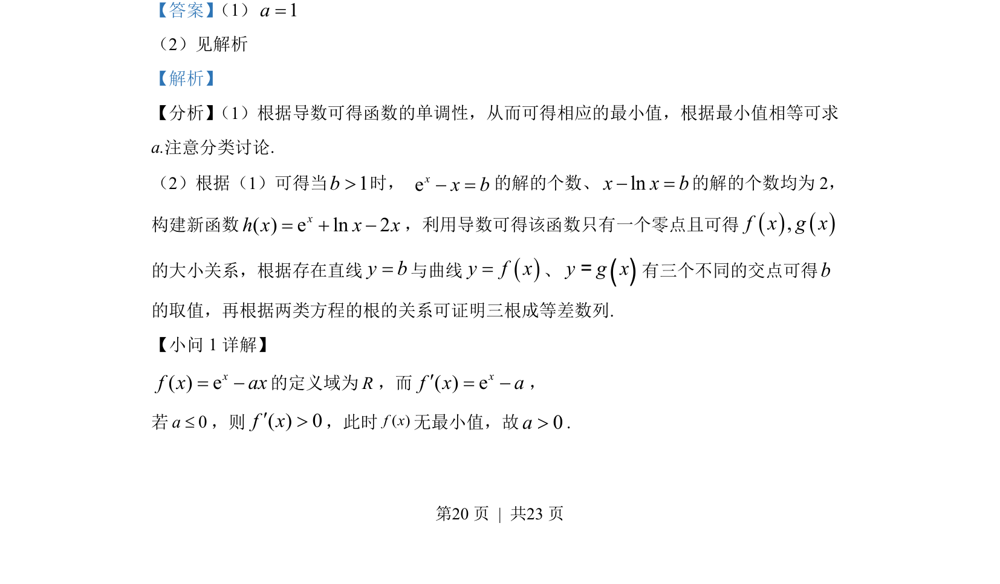
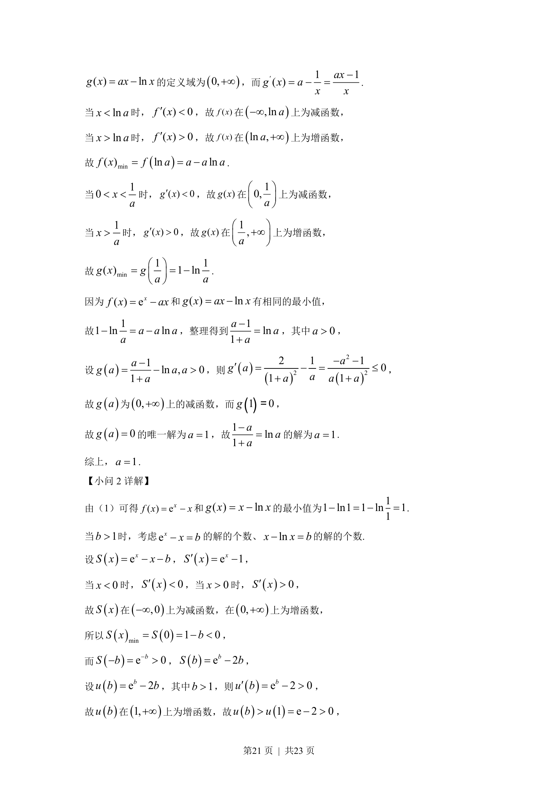
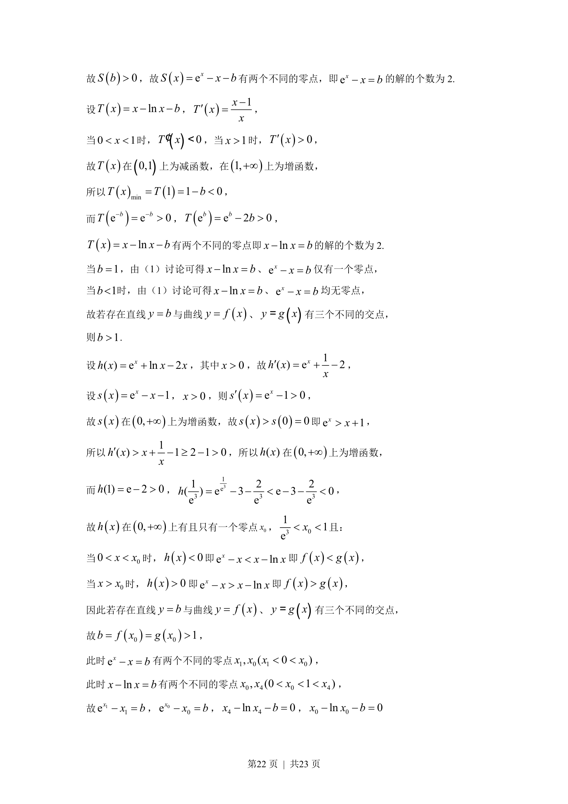
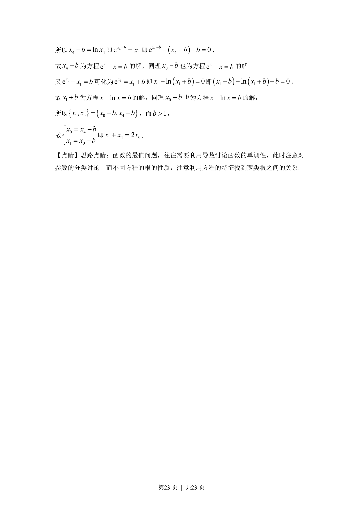

## 题面

## 摘要

考查利用导数研究函数最值与零点，结合函数交点证明三根成等差数列。

## 关联考点

- [[705-利用导数研究函数的单调性|导数与单调性]]
- [[419-函数最值-高中|函数最值]]
- [[288-函数零点|函数零点]]
- [[356-等差数列概念|等差数列]]

## 答案与解析

> 📄 原 PDF 第 20 页：`素材/真题/湖南/2008-2024·（湖南）数学高考真题/2022年高考数学试卷（新高考Ⅰ卷）（解析卷）.pdf`
