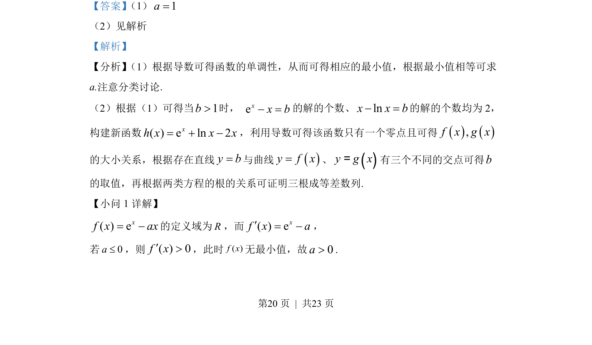
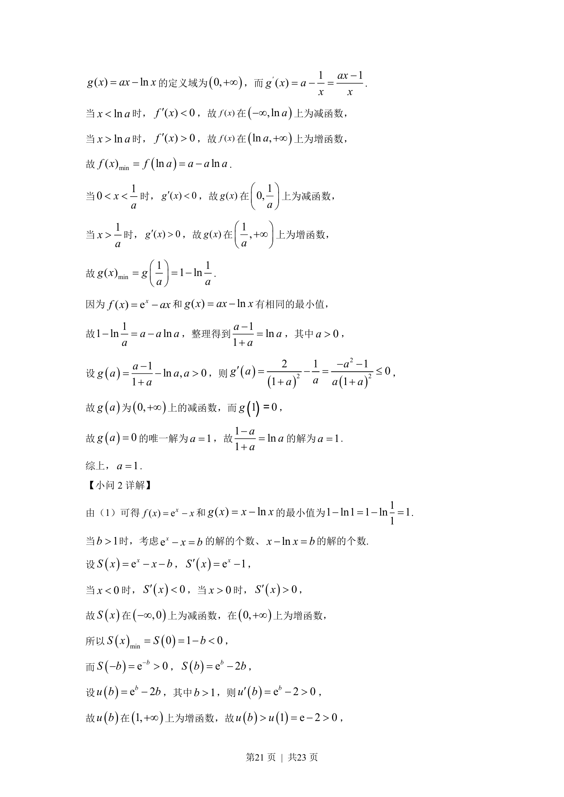
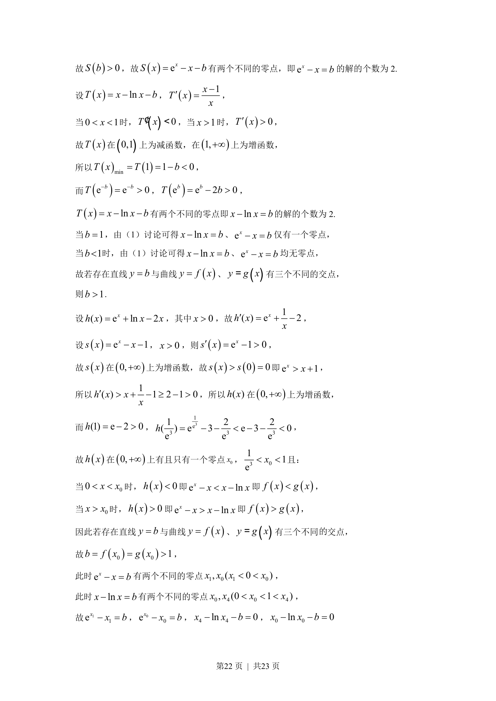
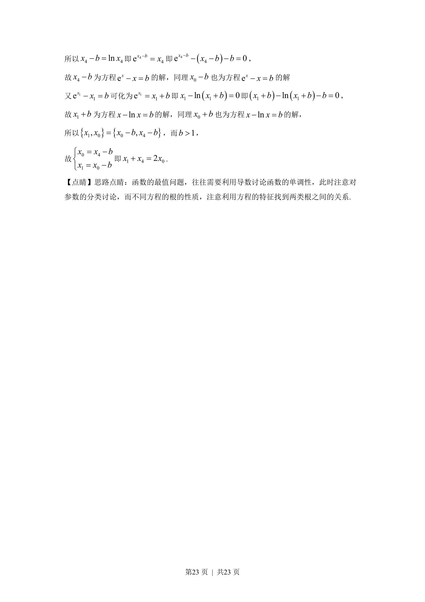

## 题面

## 摘要

考查利用导数研究函数最值与零点，结合函数交点证明三根成等差数列。

## 关联考点

- [[705-利用导数研究函数的单调性|导数与单调性]]
- [[419-函数最值-高中|函数最值]]
- [[288-函数零点|函数零点]]
- [[356-等差数列概念|等差数列]]

## 答案与解析

> 📄 原 PDF 第 20 页：`素材/真题/湖南/2008-2024·（湖南）数学高考真题/2022年高考数学试卷（新高考Ⅰ卷）（解析卷）.pdf`

<!-- 题干文本-start -->
## 题干文本
22. 已知函数( )xf x e ax= -和( ) lng x ax x= -有相同 最小值．
（1）求 a；
（2）证明：存在直线y b=，其与两条曲线( )y f x=和( )y g x=共有三个不同的交点，并
且从左到右的三个交点的横坐标成等差数列．
<!-- 题干文本-end -->

<!-- 解析文本-start -->
## 解析文本
【答案】 （1）1a=    
（2）见解析
【解析】
【分析】 （1）根据导数可得函数的单调性，从而可得相应的最小值，根据最小值相等可求
a.注意分类讨论.
（2）根据（1）可得当1b>时， exx b- =的解的个数、lnx x b- =的解的个数均为 2，
构建新函数( ) e ln 2xh x x x= + -，利用导数可得该函数只有一个零点且可得,f x g x
的大小关系，根据存在直线y b=与曲线y f x=、()y g x=有三个不同的交点可得b
的取值，再根据两类方程的根的关系可证明三根成等差数列.
【小问 1 详解】
( ) exf x ax= -的定义域为R，而( ) e¢= -xf x a，
若0a£，则( ) 0f x¢>，此时( )f x无最小值，故0a>.
的
<!-- 解析文本-end -->
