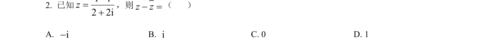
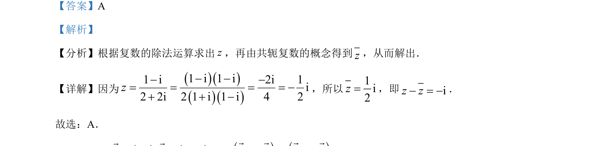

## 题面

## 摘要

考查复数的除法运算及共轭复数概念，求共轭复数之差。

## 关联考点

- [[332-复数的乘除运算|复数除法]]
- [[534-共轭复数|共轭复数]]
- [[334-复数的加减运算|复数减法]]

## 答案与解析

> 📄 原 PDF 第 2 页：`素材/真题/湖南/2008-2024·（湖南）数学高考真题/2023年高考数学试卷（新课标Ⅰ卷）（解析卷）.pdf`
