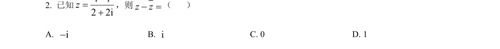
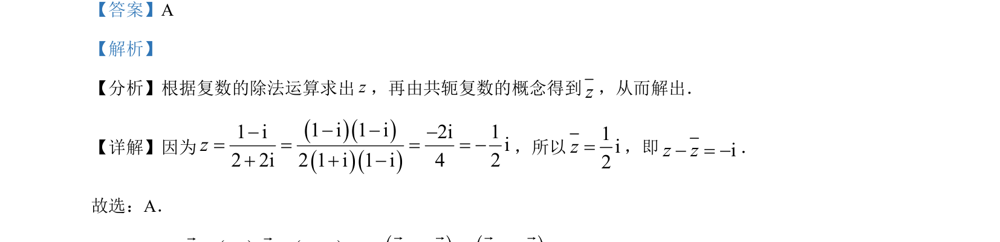

## 题面

## 摘要

考查复数的除法运算及共轭复数概念，求共轭复数之差。

## 关联考点

- [[332-复数的乘除运算|复数除法]]
- [[534-共轭复数|共轭复数]]
- [[334-复数的加减运算|复数减法]]

## 答案与解析

> 📄 原 PDF 第 2 页：`素材/真题/湖南/2008-2024·（湖南）数学高考真题/2023年高考数学试卷（新课标Ⅰ卷）（解析卷）.pdf`

<!-- 题干文本-start -->
## 题干文本
2. 已知1 i2 2iz-=+
，则z z- =（    ）
A. i-B. iC. 0 D. 1
<!-- 题干文本-end -->

<!-- 解析文本-start -->
## 解析文本
【答案】A
【解析】
【分析】根据复数的除法运算求出z，再由共轭复数的概念得到z，从而解出．
【详解】因为
()()()()1 i 1 i1 i 2i 1i2 2i 2 1 i 1 i 4 2z- -- -= = = = -+ + -，所以1i2z=，即iz z- = -．
故选：A．
<!-- 解析文本-end -->
