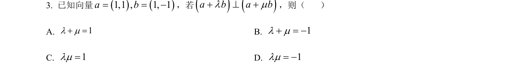
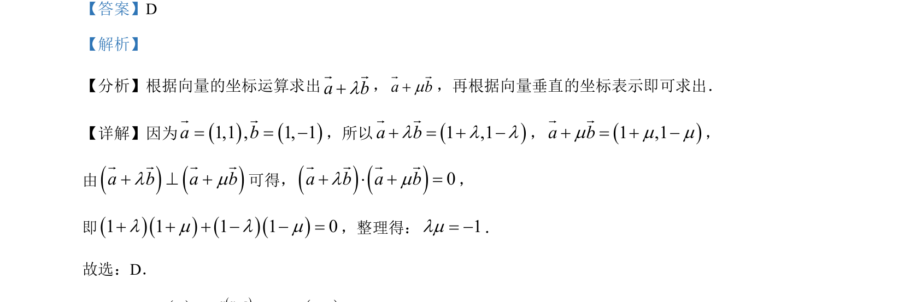

## 题面

## 摘要

向量坐标运算及垂直条件的应用

## 关联考点

- [[1358-向量的坐标运算|向量的坐标运算]]
- [[1407-向量垂直的坐标表示|向量垂直的坐标表示]]
- [[328-向量的数量积|数量积]]

## 答案与解析

> 📄 原 PDF 第 2 页：`素材/真题/湖南/2008-2024·（湖南）数学高考真题/2023年高考数学试卷（新课标Ⅰ卷）（解析卷）.pdf`
