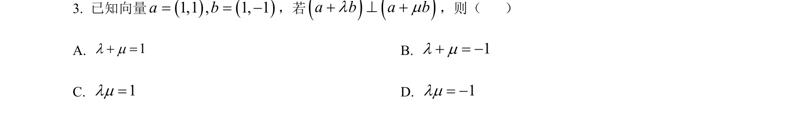
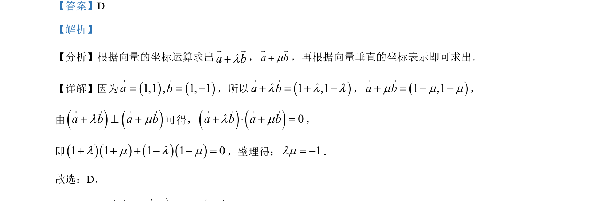

## 题面

## 摘要

向量坐标运算及垂直条件的应用

## 关联考点

- [[541-向量坐标运算|向量的坐标运算]]
- [[1407-向量垂直的坐标表示|向量垂直的坐标表示]]
- [[328-向量的数量积|数量积]]

## 答案与解析

> 📄 原 PDF 第 2 页：`素材/真题/湖南/2008-2024·（湖南）数学高考真题/2023年高考数学试卷（新课标Ⅰ卷）（解析卷）.pdf`

<!-- 题干文本-start -->
## 题干文本
3. 已知向量1,1 , 1, 1a b= = -r r
，若a b a bl m+ ^ +r r r r
，则（    ）
A. 1l m+ =B. 1l m+ = -
C. 1lm=D. 1lm= -
<!-- 题干文本-end -->

<!-- 解析文本-start -->
## 解析文本
【答案】D
【解析】
【分析】根据向量的坐标运算求出a bl+r r
，a bm+r r
，再根据向量垂直的坐标表示即可求出．
【详解】因为1,1 , 1, 1a b= = -r r
，所以1 ,1a bl l l+ = + -r r
，1 ,1a bm m m+ = + -r r
，
由a b a bl m+ ^ +r r r r
可得，0a b a bl m+ × + =r r r r
，
即1 1 1 1 0l m l m+ + + - - =，整理得：1lm= -．
故选：D．
<!-- 解析文本-end -->
