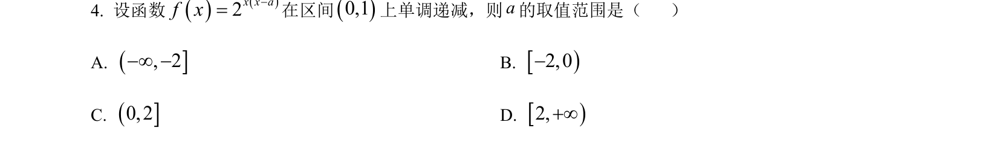
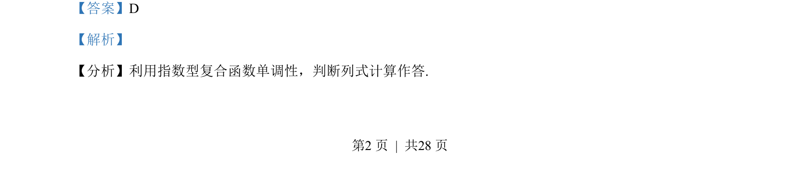
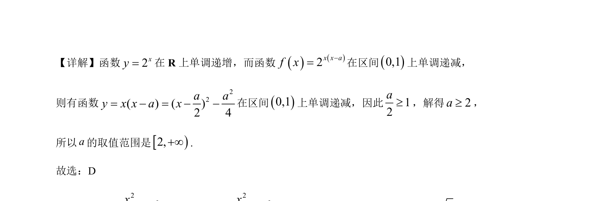

## 题面

## 摘要

利用指数函数单调性及复合函数单调性，结合二次函数在给定区间上递减求参数范围。

## 关联考点

- [[复合函数单调性]]
- [[304-指数函数|指数函数]]
- [[212-二次函数定义|二次函数]]
- [[726-参数范围|参数范围]]

## 答案与解析

> 📄 原 PDF 第 2 页：`素材/真题/湖南/2008-2024·（湖南）数学高考真题/2023年高考数学试卷（新课标Ⅰ卷）（解析卷）.pdf`
