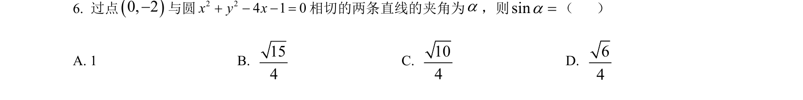
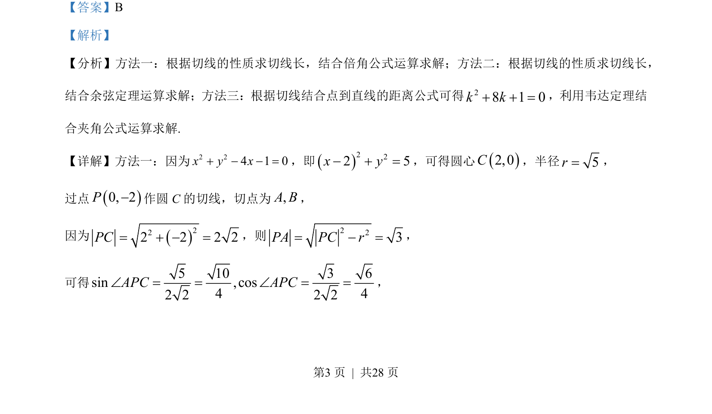
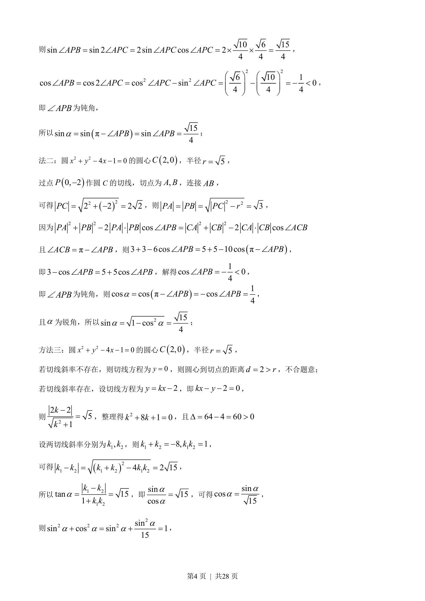
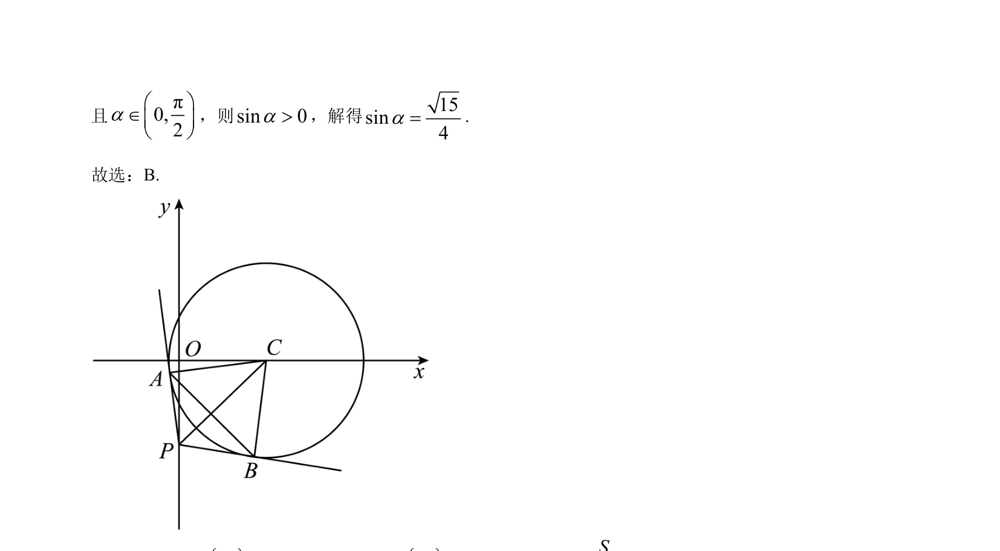

## 题面

## 摘要

本题考查过圆外一点作切线并求两切线夹角的正弦值，涉及几何与代数多种解法。

## 关联考点

- [[217-切线|圆的切线]]
- [[倍角公式]]
- [[126-定理|余弦定理]]
- [[234-韦达定理-初中|韦达定理]]

## 答案与解析

> 📄 原 PDF 第 3 页：`素材/真题/湖南/2008-2024·（湖南）数学高考真题/2023年高考数学试卷（新课标Ⅰ卷）（解析卷）.pdf`
