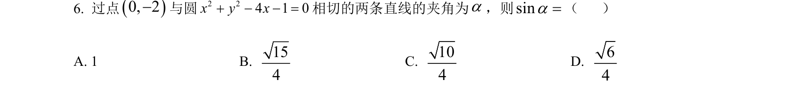
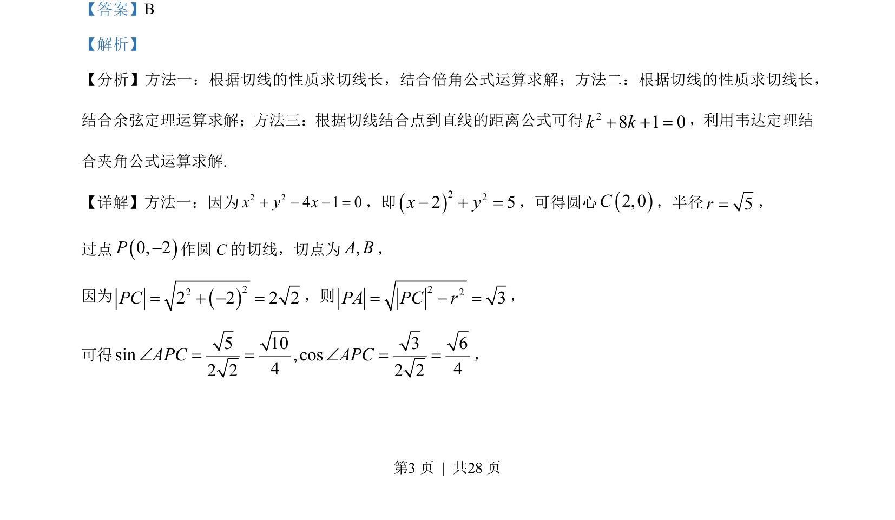
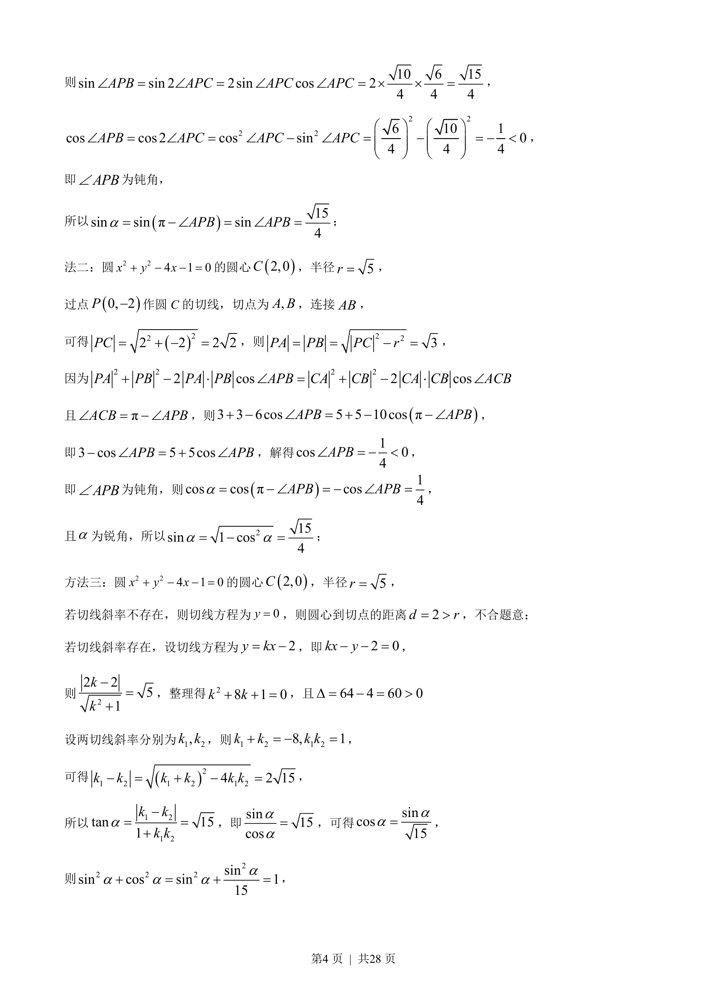
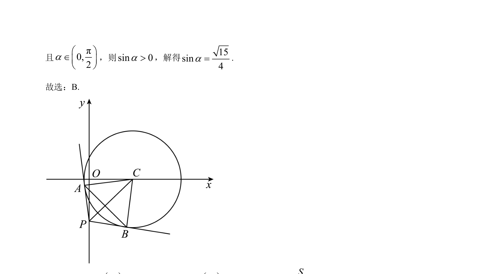

## 题面

## 摘要

本题考查过圆外一点作切线并求两切线夹角的正弦值，涉及几何与代数多种解法。

## 关联考点

- [[217-切线|圆的切线]]
- [[倍角公式]]
- [[126-定理|余弦定理]]
- [[234-韦达定理-初中|韦达定理]]

## 答案与解析

> 📄 原 PDF 第 3 页：`素材/真题/湖南/2008-2024·（湖南）数学高考真题/2023年高考数学试卷（新课标Ⅰ卷）（解析卷）.pdf`

<!-- 题干文本-start -->
## 题干文本
6. 过点0, 2-与圆2 24 1 0x y x+ - - =相切的两条直线的夹角为a，则sina=（    ）
A. 1 B. 154
C. 104
D. 64
<!-- 题干文本-end -->

<!-- 解析文本-start -->
## 解析文本
【答案】B
【解析】
【分析】方法一：根据切线的性质求切线长，结合倍角公式运算求解；方法二：根据切线的性质求切线长，
结合余弦定理运算求解；方法三：根据切线结合点到直线的距离公式可得28 1 0k k+ + =，利用韦达定理结
合夹角公式运算求解.
【详解】方法一：因为2 24 1 0x y x+ - - =，即222 5x y- + =，可得圆心2,0C，半径5r=，
过点0, 2P-作圆 C的切线，切点为,A B，
因为 222 2 2 2PC= + - =，则 223PA PC r= - =，
可得 5 10 3 6sin ,cos4 42 2 2 2APC APCÐ = = Ð = =，
<!-- 解析文本-end -->
