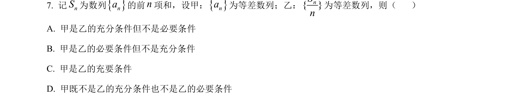
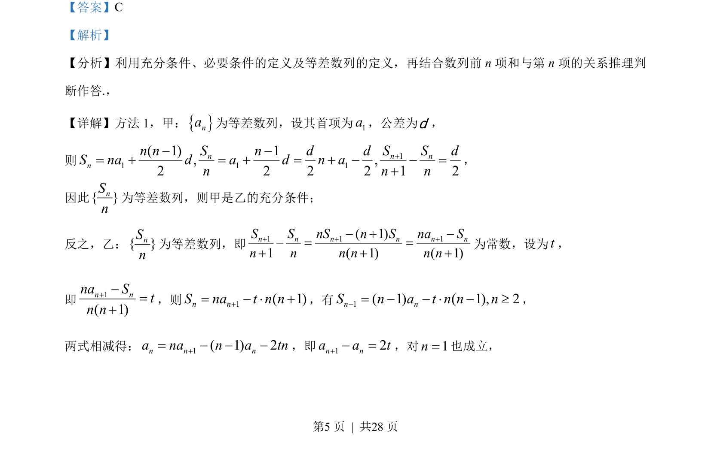
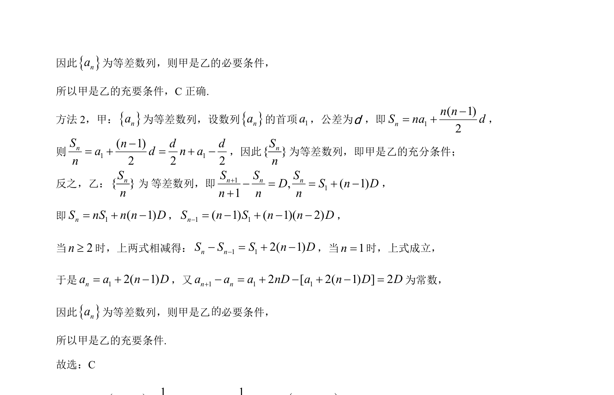

## 题面

## 摘要

考查等差数列定义、前n项和与充分必要条件关系的推理判断。

## 关联考点

- [[356-等差数列概念|等差数列]]
- [[533-充分必要条件|充分必要条件]]
- [[355-等差数列前n项和|前n项和]]

## 答案与解析

> 📄 原 PDF 第 5 页：`素材/真题/湖南/2008-2024·（湖南）数学高考真题/2023年高考数学试卷（新课标Ⅰ卷）（解析卷）.pdf`
