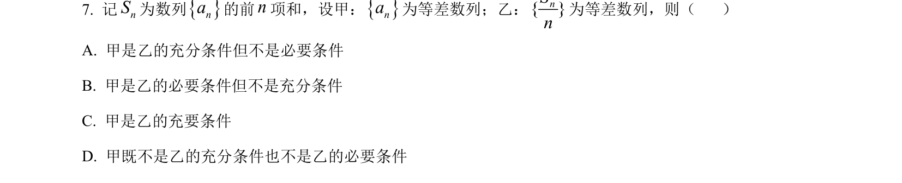
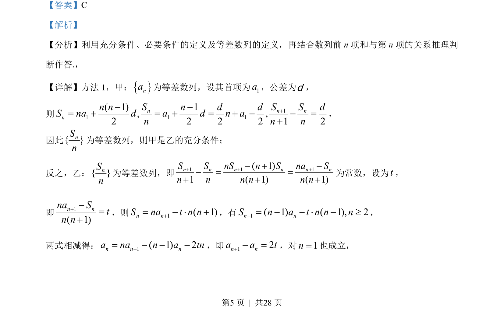
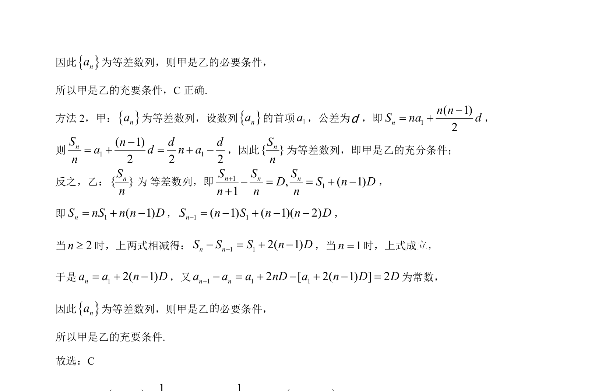

## 题面

## 摘要

考查等差数列定义、前n项和与充分必要条件关系的推理判断。

## 关联考点

- [[356-等差数列概念|等差数列]]
- [[533-充分必要条件|充分必要条件]]
- [[355-等差数列前n项和|前n项和]]

## 答案与解析

> 📄 原 PDF 第 5 页：`素材/真题/湖南/2008-2024·（湖南）数学高考真题/2023年高考数学试卷（新课标Ⅰ卷）（解析卷）.pdf`

<!-- 题干文本-start -->
## 题干文本
7. 记nS为数列na的前n项和，设甲：na为等差数列；乙：{ }nSn
为等差数列，则（    ）
A. 甲是乙的充分条件但不是必要条件
B. 甲是乙的必要条件但不是充分条件
C. 甲是乙的充要条件
D. 甲既不是乙的充分条件也不是乙的必要条件
<!-- 题干文本-end -->

<!-- 解析文本-start -->
## 解析文本
【答案】C
【解析】
【分析】利用充分条件、必要条件的定义及等差数列的定义，再结合数列前 n 项和与第 n 项的关系推理判
断作答.，
【详解】方法 1，甲：na为等差数列，设其首项为1a，公差为d，
则 11 1 1( 1) 1, ,2 2 2 2 1 2n n nnS S Sn n n d d dS na d a d n an n n+- -= + = + = + - - =+
，
因此{ }nSn
为等差数列，则甲是乙的充分条件；
反之，乙：{ }nSn
为等差数列，即1 1 1( 1)1 ( 1) ( 1)n n n n n nS S nS n S na Sn n n n n n+ + +- + -- = =+ + +为常数，设为t，
即1( 1)n nna Stn n+-=+，则 1( 1)n nS na t n n+= - × +，有1( 1) ( 1), 2n nS n a t n n n-= - - × - ³，
两式相减得： 1( 1) 2n n na na n a tn+= - - -，即12n na a t+- =，对1n=也成立，
<!-- 解析文本-end -->
