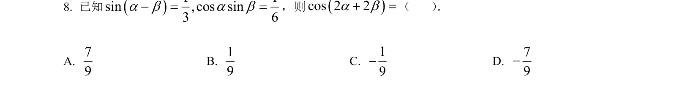
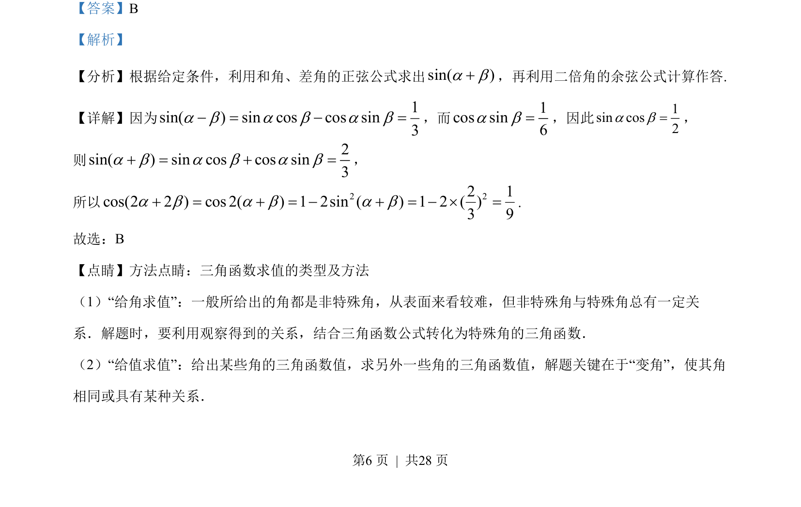
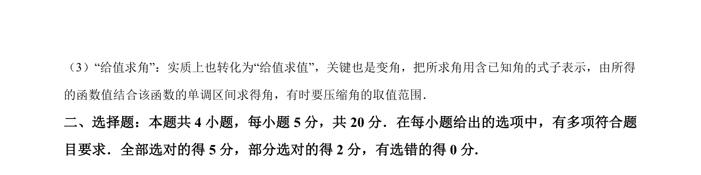

## 题面

## 摘要

利用和差角正弦公式及二倍角余弦公式进行三角函数求值。

## 关联考点

- [[631-两角和与差的正弦函数|两角和与差的正弦公式]]
- [[二倍角余弦公式]]
- [[610-三角函数求值|三角函数求值]]

## 答案与解析

> 📄 原 PDF 第 6 页：`素材/真题/湖南/2008-2024·（湖南）数学高考真题/2023年高考数学试卷（新课标Ⅰ卷）（解析卷）.pdf`
