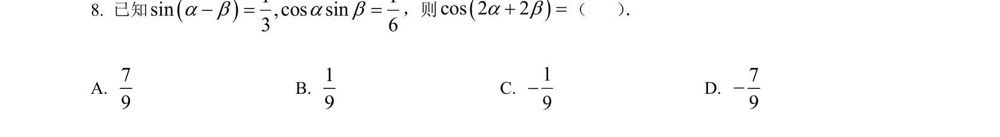
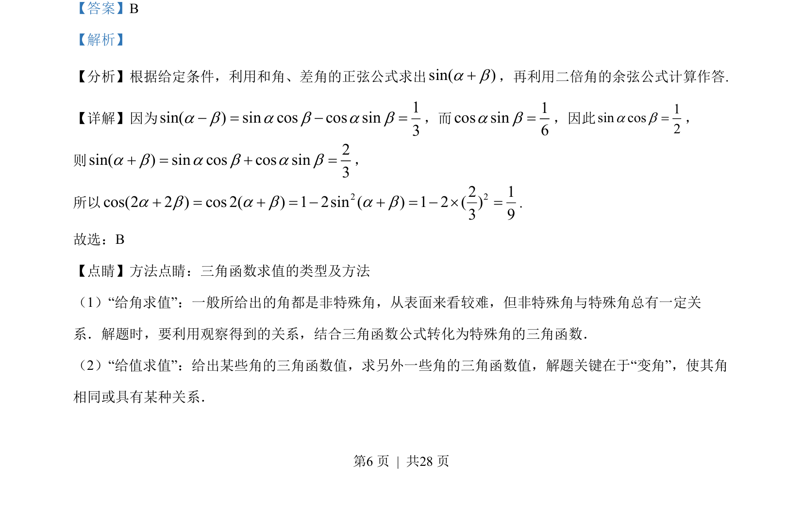
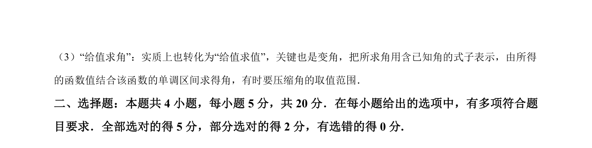

## 题面

## 摘要

利用和差角正弦公式及二倍角余弦公式进行三角函数求值。

## 关联考点

- [[631-两角和与差的正弦函数|两角和与差的正弦公式]]
- [[639-二倍角的余弦公式|二倍角余弦公式]]
- [[610-三角函数求值|三角函数求值]]

## 答案与解析

> 📄 原 PDF 第 6 页：`素材/真题/湖南/2008-2024·（湖南）数学高考真题/2023年高考数学试卷（新课标Ⅰ卷）（解析卷）.pdf`

<!-- 题干文本-start -->
## 题干文本
8. 已知()1 1sin ,cos sin3 6a b a b- = =，则()cos 2 2a b+ =（    ） ．
A. 79
B. 19
C. 19-D. 79-
<!-- 题干文本-end -->

<!-- 解析文本-start -->
## 解析文本
【答案】B
【解析】
【分析】根据给定条件，利用和角、差角的正弦公式求出sin( )a b+，再利用二倍角的余弦公式计算作答.
【详解】因为 1sin( ) sin cos cos sin3a b a b a b- = - =，而 1cos sin6a b=，因此 1sin cos2a b=，
则 2sin( ) sin cos cos sin3a b a b a b+ = + =，
所以 2 22 1cos(2 2 ) cos 2( ) 1 2sin ( ) 1 2 ( )3 9a b a b a b+ = + = - + = - ´ =.
故选：B
【点睛】方法点睛：三角函数求值的类型及方法
（1）“给角求值”：一般所给出的角都是非特殊角，从表面来看较难，但非特殊角与特殊角总有一定关
系．解题时，要利用观察得到的关系，结合三角函数公式转化为特殊角的三角函数．
（2）“给值求值”：给出某些角的三角函数值，求另外一些角的三角函数值，解题关键在于“变角”，使其角
相同或具有某种关系．
为的
<!-- 解析文本-end -->
