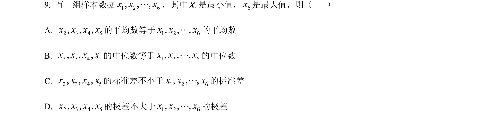
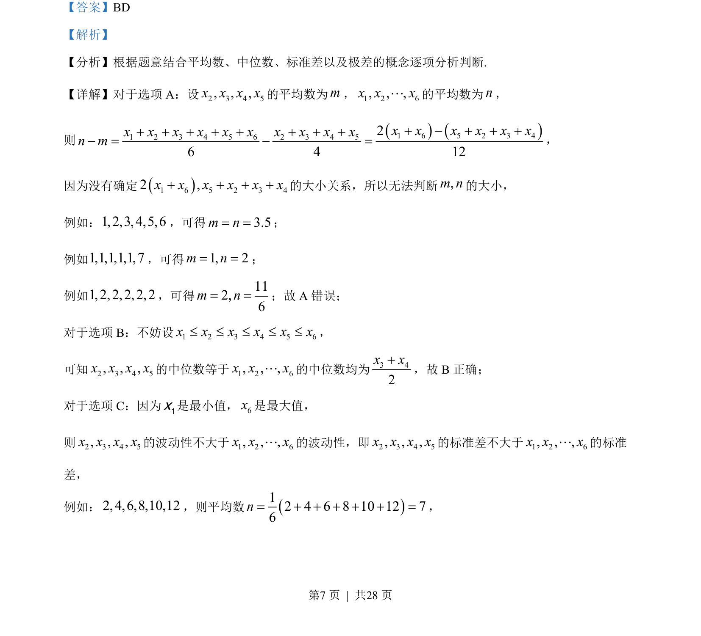
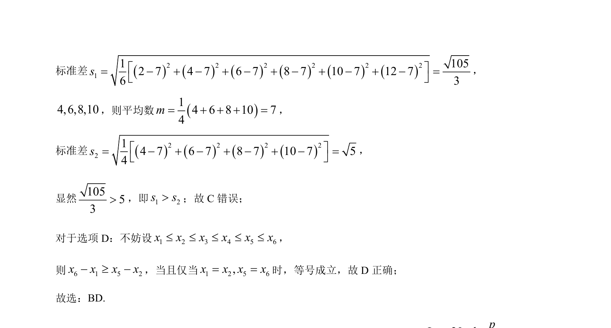

## 题面

## 摘要

考查利用平均数、中位数的概念判断统计量大小关系，结合特例比较分析选项正误。

## 关联考点

- [[055-平均数|平均数]]
- [[180-中位数|中位数]]

## 答案与解析

> 📄 原 PDF 第 7 页：`素材/真题/湖南/2008-2024·（湖南）数学高考真题/2023年高考数学试卷（新课标Ⅰ卷）（解析卷）.pdf`

<!-- 题干文本-start -->
## 题干文本
9. 有一组样本数据1 2 6, , ,x x x×××，其中1x是最小值，6x是最大值，则（    ）
A. 2 3 4 5, , ,x x x x的平均数等于1 2 6, , ,x x x×××的平均数
B. 2 3 4 5, , ,x x x x的中位数等于1 2 6, , ,x x x×××的中位数
C. 2 3 4 5, , ,x x x x的标准差不小于1 2 6, , ,x x x×××的标准差
D. 2 3 4 5, , ,x x x x的极差不大于1 2 6, , ,x x x×××的极差
<!-- 题干文本-end -->

<!-- 解析文本-start -->
## 解析文本
【答案】BD
【解析】
【分析】根据题意结合平均数、中位数、标准差以及极差的概念逐项分析判断.
【详解】对于选项 A：设2 3 4 5, , ,x x x x的平均数为m，1 2 6, , ,x x x×××的平均数为n，
则 1 6 5 2 3 41 2 3 4 5 6 2 3 4 526 4 12x x x x x xx x x x x x x x x xn m+ - + + ++ + + + + + + +- = - =，
因为没有确定1 6 5 2 3 42 ,x x x x x x+ + + +的大小关系，所以无法判断,m n的大小，
例如：1, 2,3, 4,5,6，可得3.5m n= =；
例如1,1,1,1,1,7，可得1, 2m n= =；
例如1, 2, 2, 2, 2, 2，可得 112,6m n= =；故 A 错误；
对于选项 B：不妨设1 2 3 4 5 6x x x x x x£ £ £ £ £，
可知2 3 4 5, , ,x x x x的中位数等于1 2 6, , ,x x x×××的中位数均为3 42x x+，故 B正确；
对于选项 C：因为1x是最小值，6x是最大值，
则2 3 4 5, , ,x x x x的波动性不大于1 2 6, , ,x x x×××的波动性，即2 3 4 5, , ,x x x x的标准差不大于1 2 6, , ,x x x×××的标准
差，
例如：2, 4,6,8,10,12，则平均数12 4 6 8 10 12 76n= + + + + + =，
<!-- 解析文本-end -->
