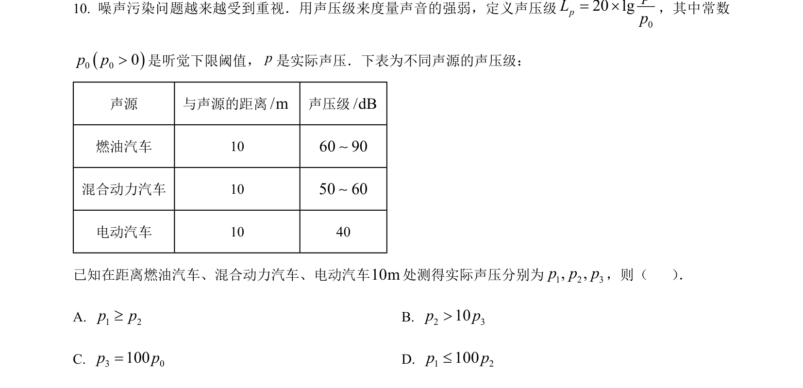
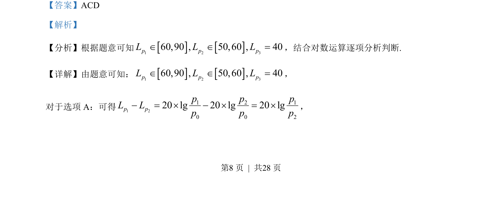
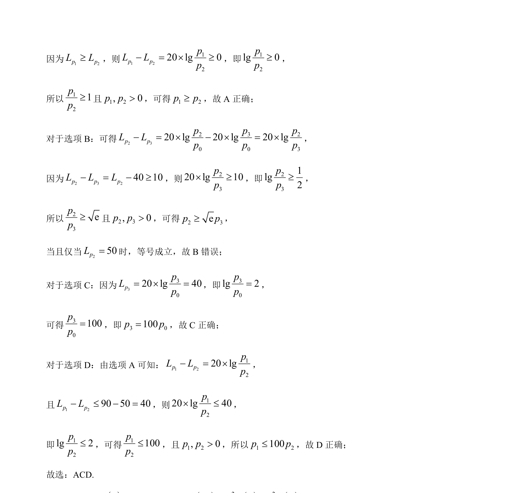

## 题面

## 摘要

该题以声压级公式为背景，考查对数运算与不等式推导，需依据给定数值判断声压大小关系及等号条件。

## 关联考点

- [[832-对数运算|对数运算]]
- [[对数不等式]]
- [[函数模型应用]]

## 答案与解析

> 📄 原 PDF 第 8 页：`素材/真题/湖南/2008-2024·（湖南）数学高考真题/2023年高考数学试卷（新课标Ⅰ卷）（解析卷）.pdf`
