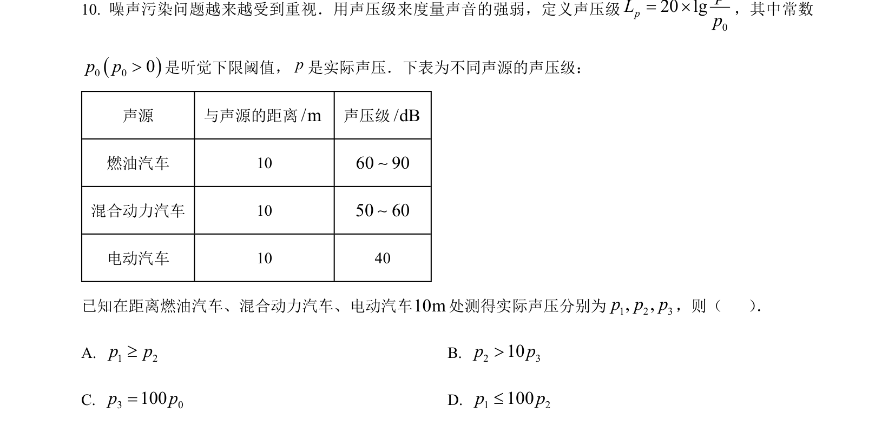
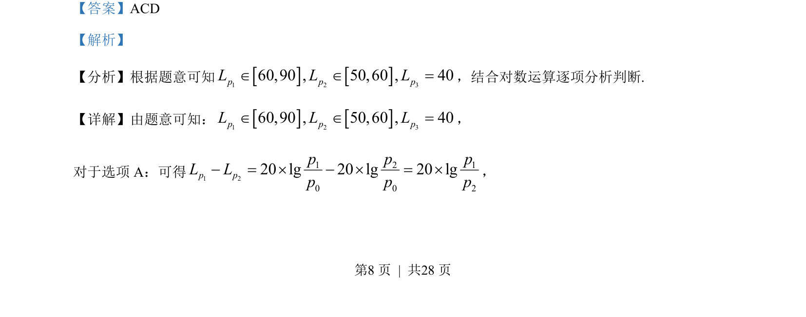
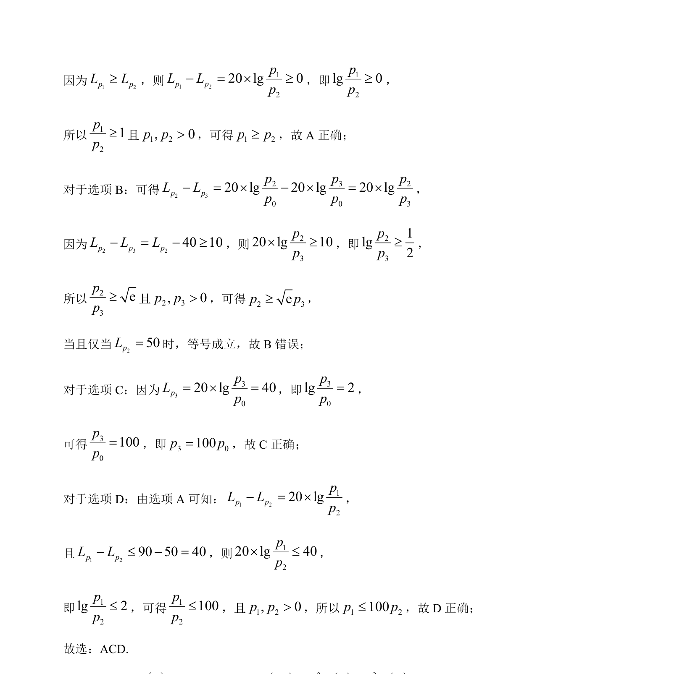

## 题面

## 摘要

该题以声压级公式为背景，考查对数运算与不等式推导，需依据给定数值判断声压大小关系及等号条件。

## 关联考点

- [[832-对数运算|对数运算]]
- [[对数不等式]]
- [[函数模型应用]]

## 答案与解析

> 📄 原 PDF 第 8 页：`素材/真题/湖南/2008-2024·（湖南）数学高考真题/2023年高考数学试卷（新课标Ⅰ卷）（解析卷）.pdf`

<!-- 题干文本-start -->
## 题干文本
10. 噪声污染问题越来越受到重视．用声压级来度量声音的强弱，定义声压级
020 lgppLp= ´，其中常数
0 00p p>是听觉下限阈值，p是实际声压．下表为不同声源的声压级：
声源 与声源的距离/m声压级/dB
燃油汽车 10 60 90:
混合动力汽车 10 50 60:
电动汽车 10 40
已知在距离燃油汽车、混合动力汽车、电动汽车10m处测得实际声压分别为1 2 3, ,p p p，则（    ） ．
A. 1 2p p³ B. 2 310p p>
C. 3 0100p p= D. 1 2100p p£
<!-- 题干文本-end -->

<!-- 解析文本-start -->
## 解析文本
【答案】ACD
【解析】
【分析】根据题意可知1 2 360,90 , 50,60 , 40p p pL L LÎ Î =，结合对数运算逐项分析判断.
【详解】由题意可知：1 2 360,90 , 50,60 , 40p p pL L LÎ Î =，
对于选项 A：可得1 21 2 10 0 220 lg 20 lg 20 lgp pp p pL Lp p p= - ´ = ´-´，
<!-- 解析文本-end -->
