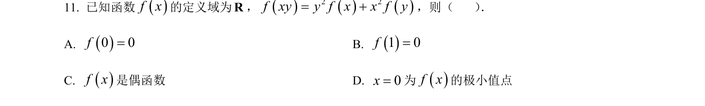
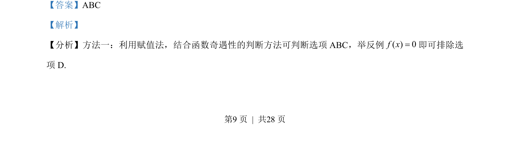
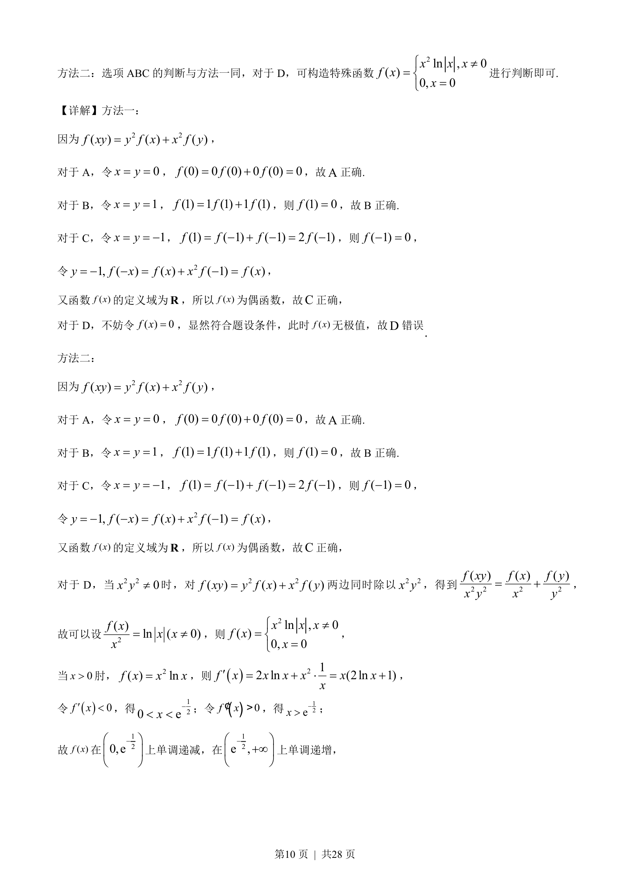
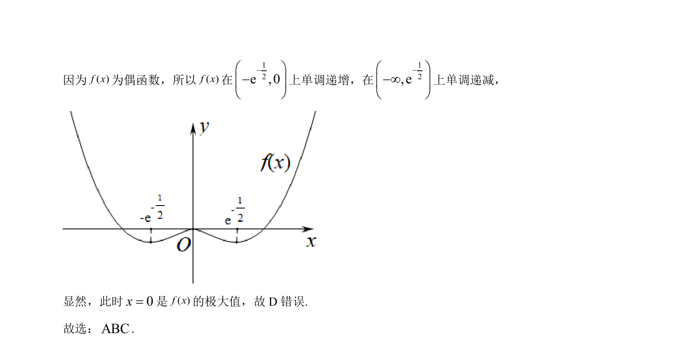

## 题面

## 摘要

考查抽象函数性质，通过赋值法判断函数值、奇偶性及反例排除极值。

## 关联考点

- [[882-抽象函数|抽象函数]]
- [[1116-赋值|赋值法]]
- [[679-函数奇偶性|函数奇偶性]]
- [[286-函数的最值|极值]]

## 答案与解析

> 📄 原 PDF 第 9 页：`素材/真题/湖南/2008-2024·（湖南）数学高考真题/2023年高考数学试卷（新课标Ⅰ卷）（解析卷）.pdf`
