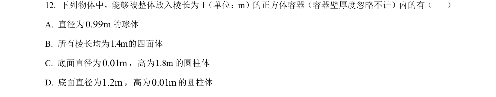
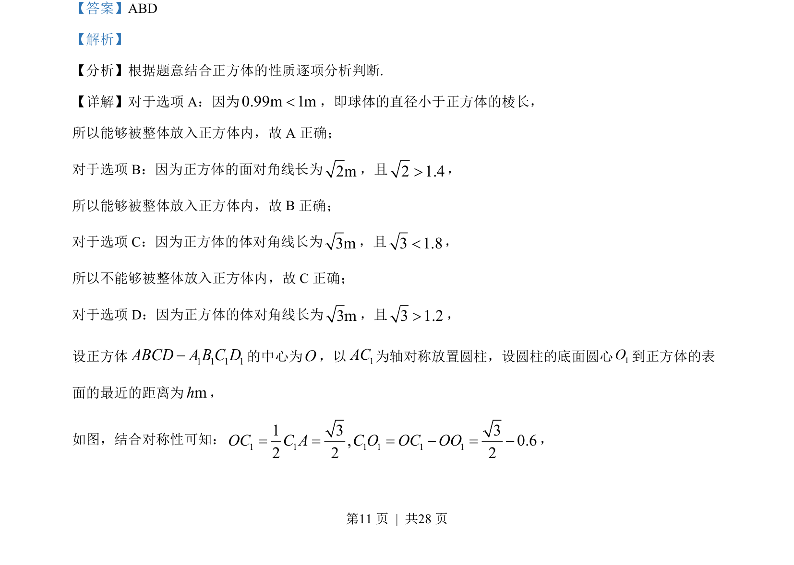
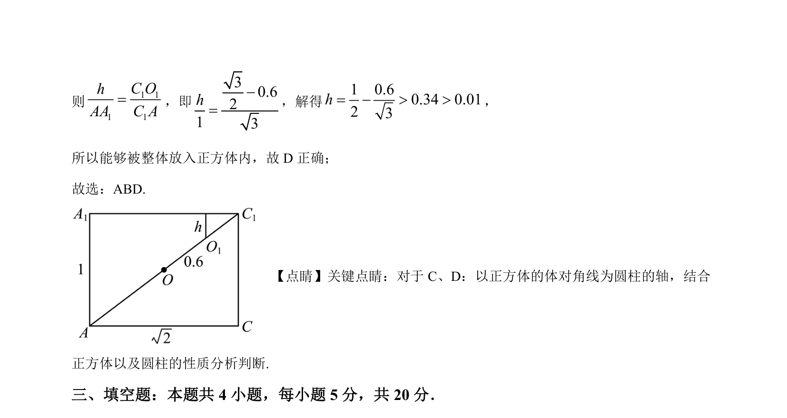

## 题面

## 摘要

判断不同几何体能否完全放入正方体，基于棱长、面对角线、体对角线比较及对称放置分析。

## 关联考点

- [[1055-立体几何|立体几何]]
- [[1195-正方体性质|正方体性质]]
- [[1053-空间想象|空间想象]]
- [[几何体截面]]

## 答案与解析

> 📄 原 PDF 第 11 页：`素材/真题/湖南/2008-2024·（湖南）数学高考真题/2023年高考数学试卷（新课标Ⅰ卷）（解析卷）.pdf`
