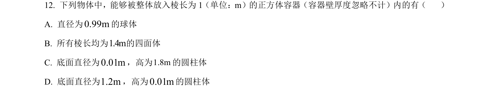
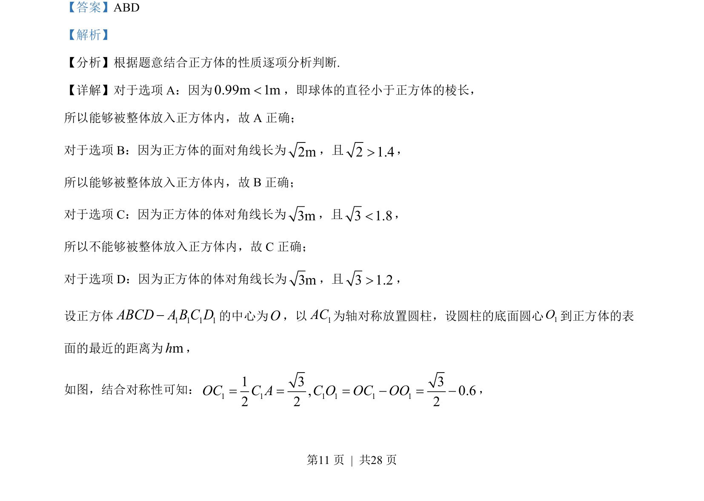
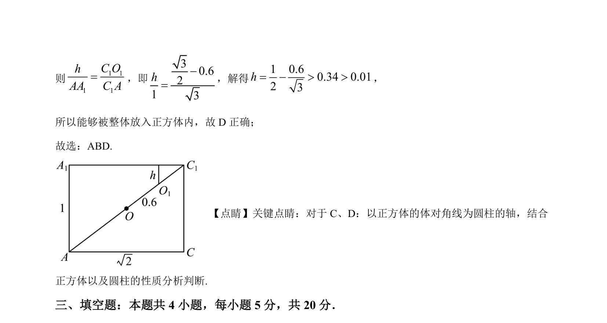

## 题面

## 摘要

判断不同几何体能否完全放入正方体，基于棱长、面对角线、体对角线比较及对称放置分析。

## 关联考点

- [[1055-立体几何|立体几何]]
- [[1195-正方体性质|正方体性质]]
- [[1053-空间想象|空间想象]]
- [[几何体截面]]

## 答案与解析

> 📄 原 PDF 第 11 页：`素材/真题/湖南/2008-2024·（湖南）数学高考真题/2023年高考数学试卷（新课标Ⅰ卷）（解析卷）.pdf`

<!-- 题干文本-start -->
## 题干文本
12. 下列物体中，能够被整体放入棱长为1（单位：m）的正方体容器（容器壁厚度忽略不计）内的有（    ）
A. 直径为0.99m的球体
B. 所有棱长均为1.4m的四面体
C. 底面直径为0.01m，高为1.8m的圆柱体
D. 底面直径为1.2m，高为0.01m的圆柱体
<!-- 题干文本-end -->

<!-- 解析文本-start -->
## 解析文本
【答案】ABD
【解析】
【分析】根据题意结合正方体的性质逐项分析判断.
【详解】对于选项 A：因为0.99m 1m<，即球体的直径小于正方体的棱长，
所以能够被整体放入正方体内，故 A 正确；
对于选项 B：因为正方体的面对角线长为2m，且2 1.4>，
所以能够被整体放入正方体内，故 B正确；
对于选项 C：因为正方体的体对角线长为3m，且3 1.8<，
所以不能够被整体放入正方体内，故 C正确；
对于选项 D：因为正方体的体对角线长为3m，且3 1.2>，
设正方体 1 1 1 1ABCD A B C D-的中心为O，以1AC为轴对称放置圆柱，设圆柱的底面圆心1O到正方体的表
面的最近的距离为mh，
如图，结合对称性可知：1 1 1 1 1 11 3 3, 0.62 2 2OC C A C O OC OO= = = - = -，
<!-- 解析文本-end -->
