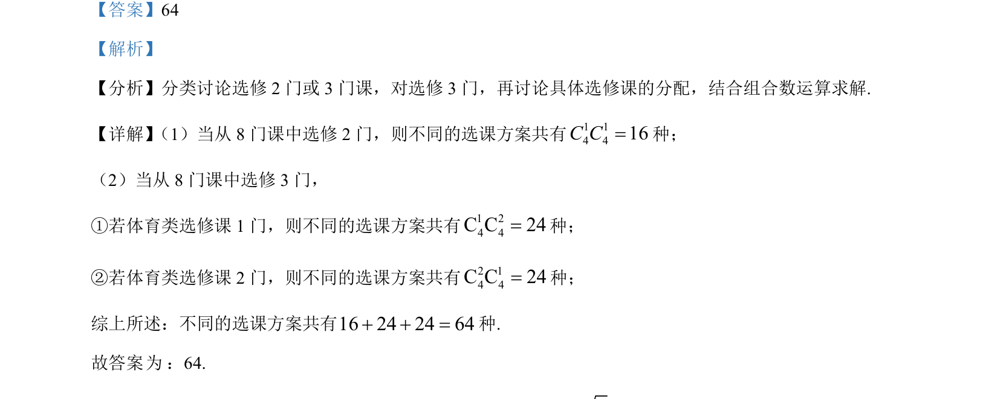

## 题面

## 摘要

考查体育类与普通类选修课的选课方案数，需分类讨论并运用组合计数求解。

## 关联考点

- [[424-参数分类讨论|分类讨论]]
- [[1090-组合计数|组合计数]]

## 答案与解析

> 📄 原 PDF 第 12 页：`素材/真题/湖南/2008-2024·（湖南）数学高考真题/2023年高考数学试卷（新课标Ⅰ卷）（解析卷）.pdf`

<!-- 题干文本-start -->
## 题干文本
13. 某学校开设了 4 门体育类选修课和 4 门艺术类选修课，学生需从这8 门课中选修 2 门或 3 门课，并且每
类选修课至少选修 1 门，则不同的选课方案共有________种（用数字作答） ．
<!-- 题干文本-end -->

<!-- 解析文本-start -->
## 解析文本
【答案】64
【解析】
【分析】分类讨论选修 2 门或 3 门课，对选修 3 门，再讨论具体选修课的分配，结合组合数运算求解.
【详解】（1）当从 8 门课中选修 2 门，则不同的选课方案共有14 4116C C=种；
（2）当从 8 门课中选修 3 门，
①若体育类选修课 1 门，则不同的选课方案共有1 24 4C C 24=种；
②若体育类选修课 2 门，则不同的选课方案共有2 14 4C C 24=种；
综上所述：不同的选课方案共有16 24 24 64+ + =种.
故答案 ： 64.
<!-- 解析文本-end -->
