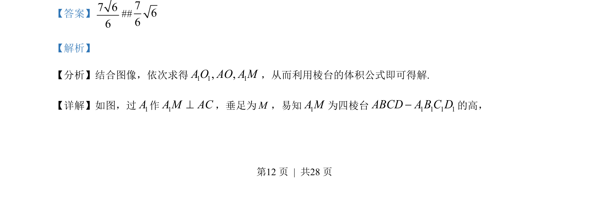
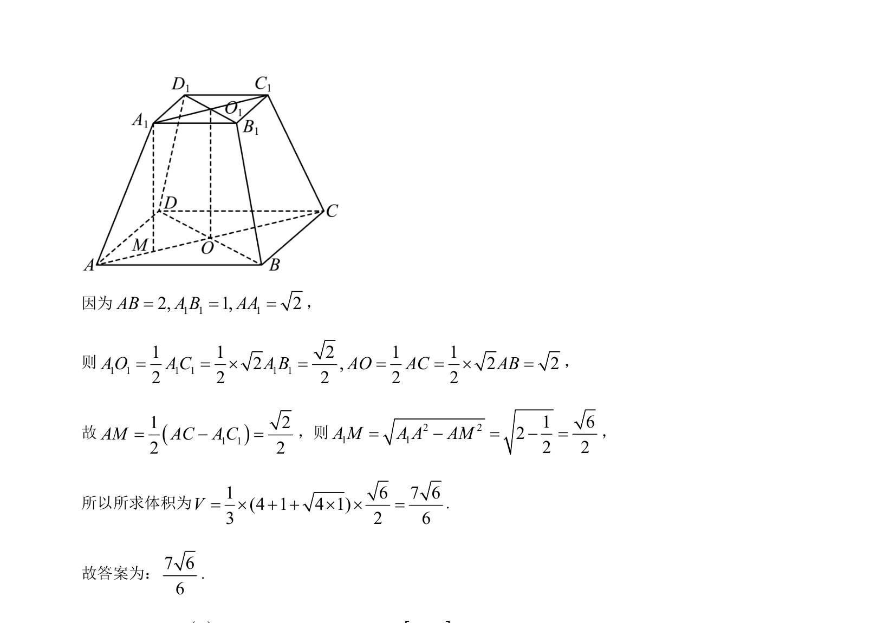

## 题面

## 摘要

本题考查四棱台的体积计算，通过作垂线求高并代入棱台体积公式求解。

## 关联考点

- [[棱台的结构特征]]
- [[棱台的体积公式]]
- [[空间几何量的计算]]

## 答案与解析

> 📄 原 PDF 第 12 页：`素材/真题/湖南/2008-2024·（湖南）数学高考真题/2023年高考数学试卷（新课标Ⅰ卷）（解析卷）.pdf`

<!-- 题干文本-start -->
## 题干文本
14. 在正四棱台 1 1 1 1ABCD A B C D-中， 1 1 12, 1, 2AB A B AA= = =，则该棱台的体积为________．
<!-- 题干文本-end -->

<!-- 解析文本-start -->
## 解析文本
【答案】7 66
##766
【解析】
【分析】结合图像，依次求得1 1 1,,A O AO A M，从而利用棱台的体积公式即可得解.
【详解】如图，过1A作1A M AC^，垂足为M，易知1AM为四棱台 1 1 1 1ABCD A B C D-的高，
为
<!-- 解析文本-end -->
