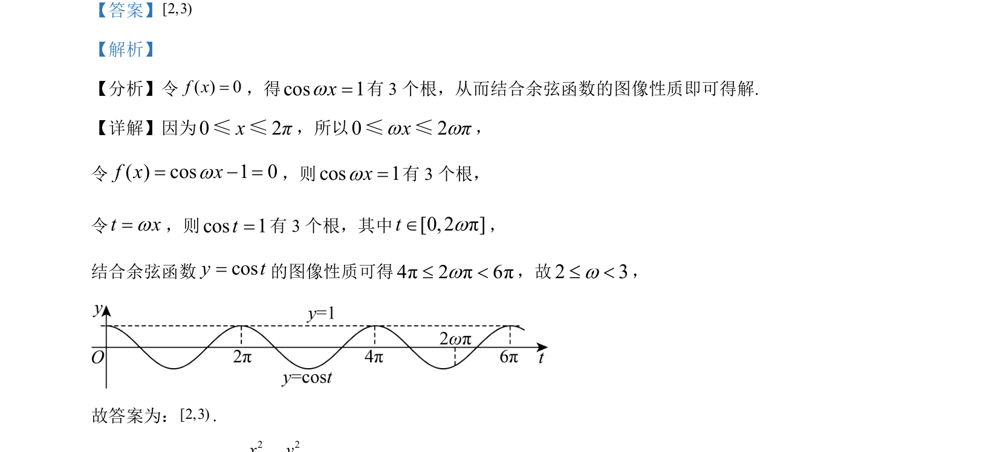

## 题面

## 摘要

根据余弦函数图像性质，通过换元法求参数取值范围，使得给定区间内方程有三个根。

## 关联考点

- [[余弦函数图像与性质]]
- [[885-换元思想|换元法]]
- [[288-函数零点|函数零点]]

## 答案与解析

> 📄 原 PDF 第 13 页：`素材/真题/湖南/2008-2024·（湖南）数学高考真题/2023年高考数学试卷（新课标Ⅰ卷）（解析卷）.pdf`
