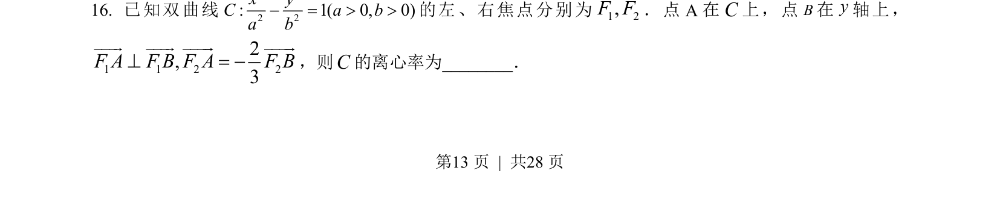
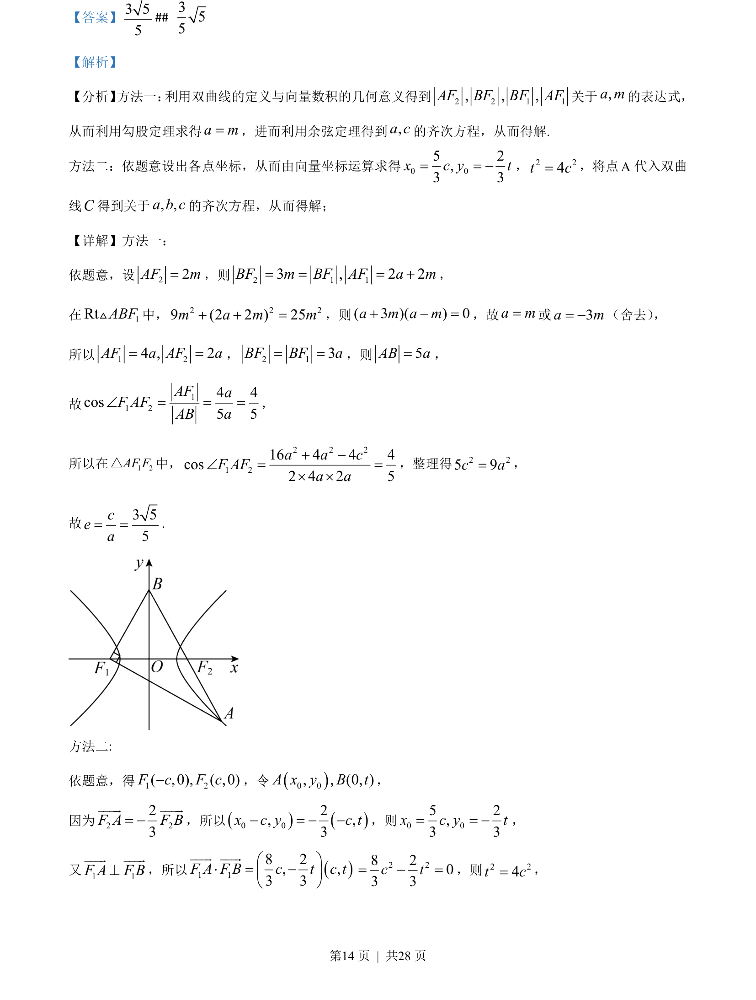
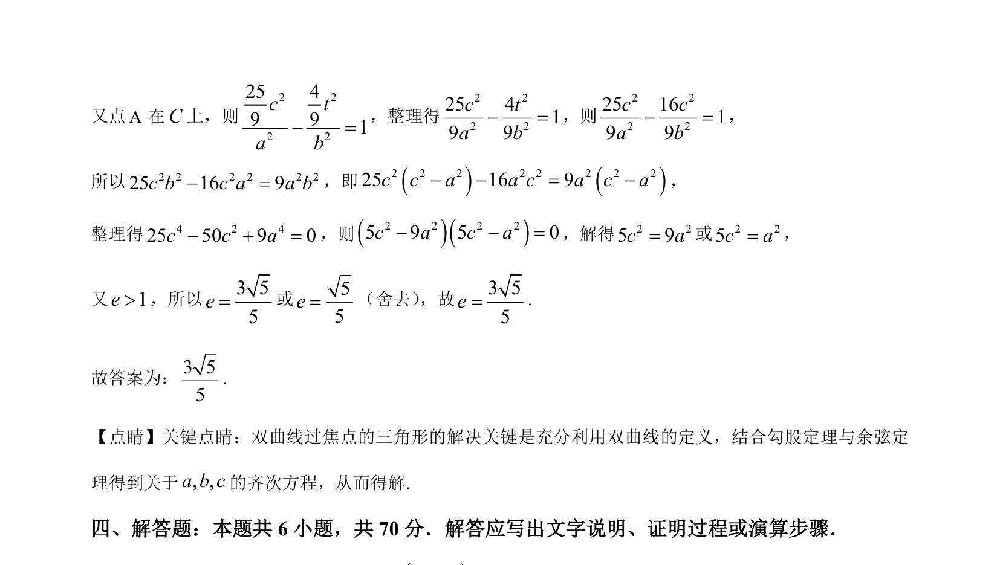

## 题面

## 摘要

求双曲线的离心率，利用定义、向量数量积与余弦定理建立齐次方程求解。

## 关联考点

- [[730-双曲线的定义|双曲线的定义]]
- [[751-向量数量积|向量数量积]]
- [[126-定理|余弦定理]]
- [[370-双曲线离心率|双曲线离心率]]

## 答案与解析

> 📄 原 PDF 第 13 页：`素材/真题/湖南/2008-2024·（湖南）数学高考真题/2023年高考数学试卷（新课标Ⅰ卷）（解析卷）.pdf`
