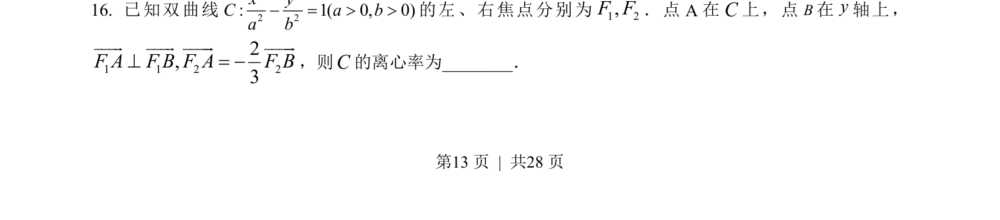
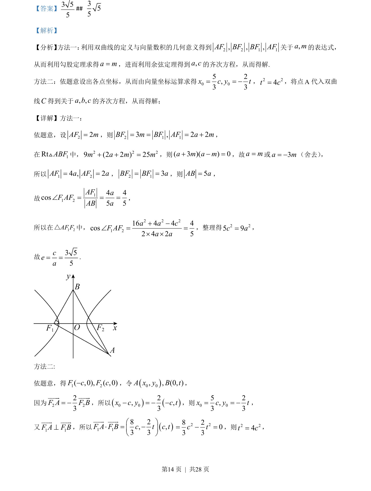
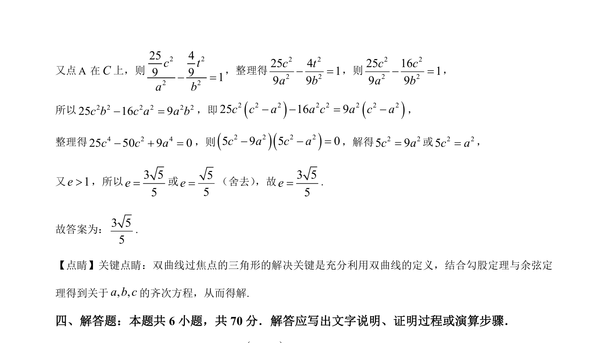

## 题面

## 摘要

求双曲线的离心率，利用定义、向量数量积与余弦定理建立齐次方程求解。

## 关联考点

- [[730-双曲线的定义|双曲线的定义]]
- [[328-向量的数量积|向量数量积]]
- [[126-定理|余弦定理]]
- [[736-双曲线的离心率|双曲线离心率]]

## 答案与解析

> 📄 原 PDF 第 13 页：`素材/真题/湖南/2008-2024·（湖南）数学高考真题/2023年高考数学试卷（新课标Ⅰ卷）（解析卷）.pdf`

<!-- 题干文本-start -->
## 题干文本
16. 已知双曲线
2 22 2: 1( 0, 0)x yC a ba b- = > >的左、右焦点分别为1 2,F F．点A在C上，点B在y轴上，
1 1 2 22,3F A F B F A F B^ = -uuur uuur uuuu r uuuu r
，则C的离心率为________．
<!-- 题干文本-end -->

<!-- 解析文本-start -->
## 解析文本

<!-- 解析文本-end -->
