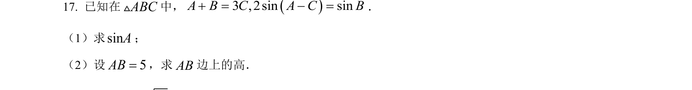
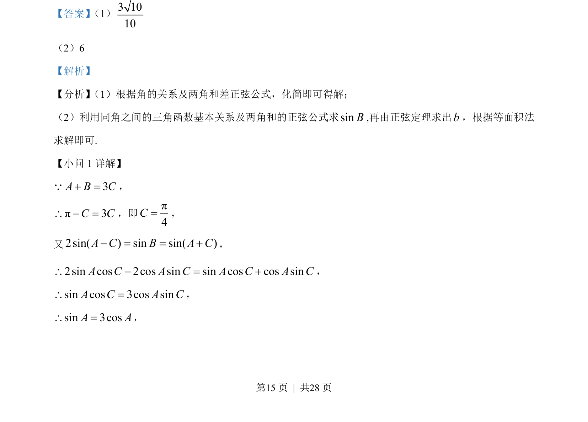
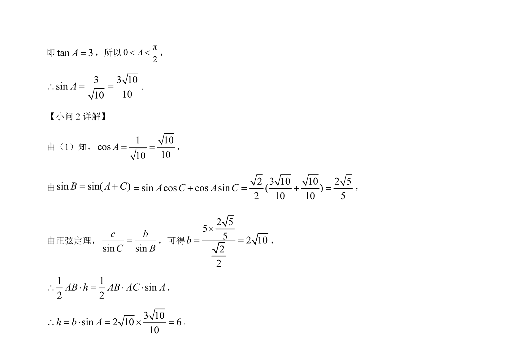

## 题面

## 摘要

考查三角恒等变换与正弦定理，包括给角求值、三角方程化简及解三角形

## 关联考点

- [[两角和差正弦公式]]
- [[741-同角三角函数基本关系|同角三角函数基本关系]]
- [[126-定理|正弦定理]]
- [[等面积法]]

## 答案与解析

> 📄 原 PDF 第 15 页：`素材/真题/湖南/2008-2024·（湖南）数学高考真题/2023年高考数学试卷（新课标Ⅰ卷）（解析卷）.pdf`
