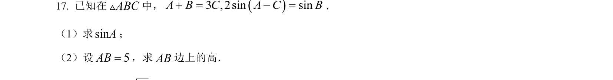
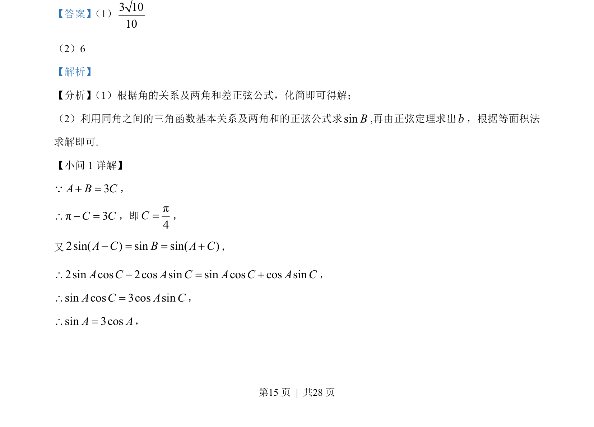
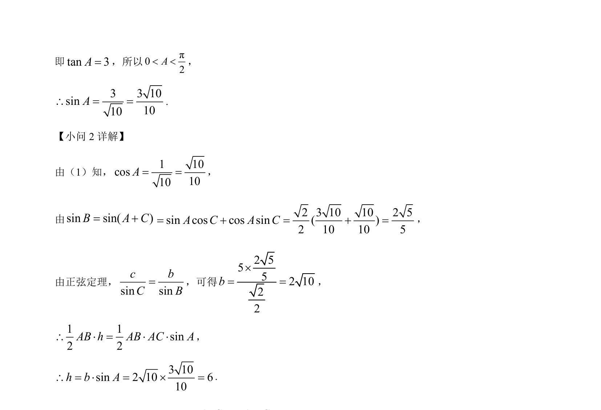

## 题面

## 摘要

考查三角恒等变换与正弦定理，包括给角求值、三角方程化简及解三角形

## 关联考点

- [[1403-两角和差正弦公式|两角和差正弦公式]]
- [[741-同角三角函数基本关系|同角三角函数基本关系]]
- [[126-定理|正弦定理]]
- [[等面积法]]

## 答案与解析

> 📄 原 PDF 第 15 页：`素材/真题/湖南/2008-2024·（湖南）数学高考真题/2023年高考数学试卷（新课标Ⅰ卷）（解析卷）.pdf`

<!-- 题干文本-start -->
## 题干文本
17. 已知在ABCV中， 3 ,2sin sinA B C A C B+ = - =．
（1）求sinA；
（2）设5AB=，求AB边上的高．
<!-- 题干文本-end -->

<!-- 解析文本-start -->
## 解析文本
【答案】 （1）3 1010
    
（2）6
【解析】
【分析】 （1）根据角的关系及两角和差正弦公式，化简即可得解；
（2）利用同角之间的三角函数基本关系及两角和的正弦公式求sinB,再由正弦定理求出b，根据等面积法
求解即可.
【小问 1 详解】
3A B C+ =Q，
π3C C\ - =，即π4C=，
又2sin( ) sin sin( )A C B A C- = = +，
2sin cos 2cos sin sin cos cos sinA C A C A C A C\ - = +，
sin cos 3cos sinA C A C\ =，
sin 3cosA A\ =，
在
<!-- 解析文本-end -->
