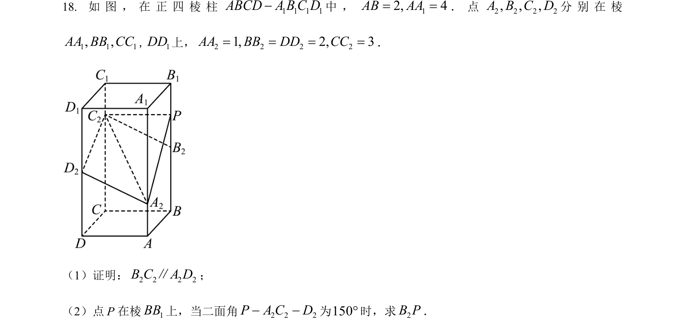
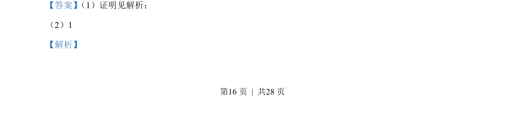
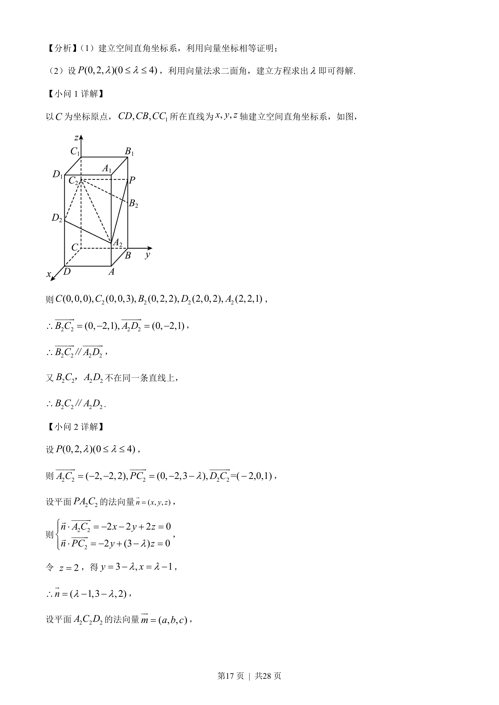
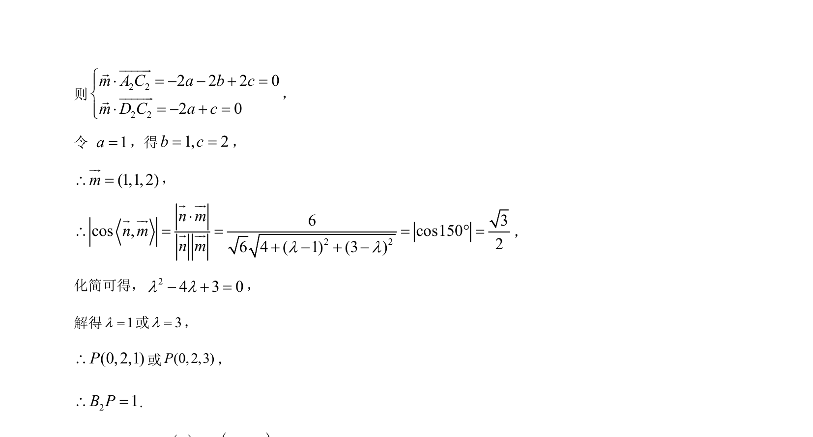

## 题面

## 摘要

本题为立体几何，建立空间直角坐标系，用向量法证明线线平行，设参数利用二面角求解点坐标。

## 关联考点

- [[399-空间向量坐标表示|空间直角坐标系]]
- [[向量法证明平行]]
- [[向量法求二面角]]
- [[061-方程|参数方程]]

## 答案与解析

> 📄 原 PDF 第 16 页：`素材/真题/湖南/2008-2024·（湖南）数学高考真题/2023年高考数学试卷（新课标Ⅰ卷）（解析卷）.pdf`
